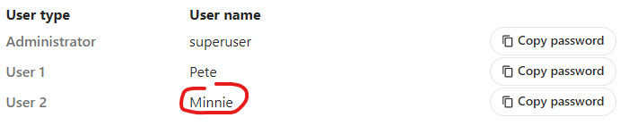
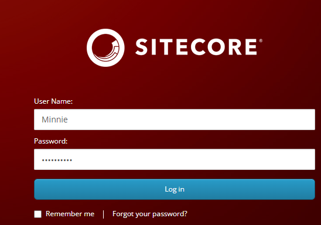
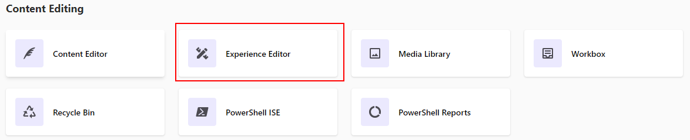
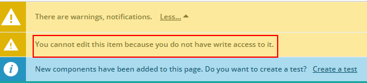
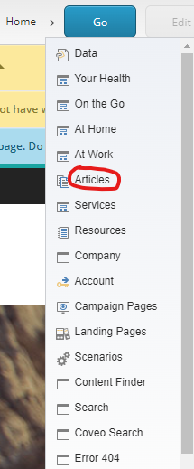
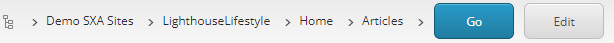
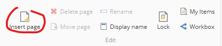
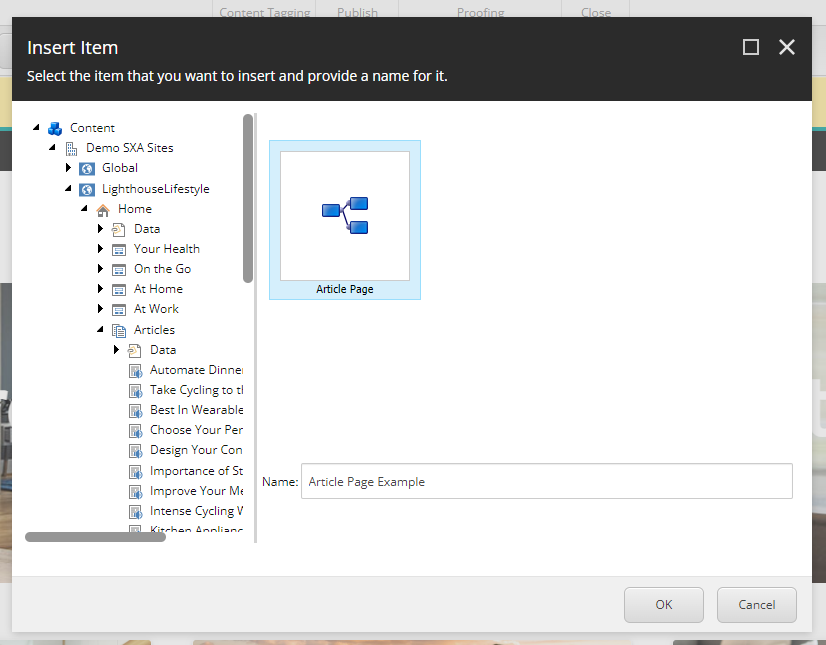
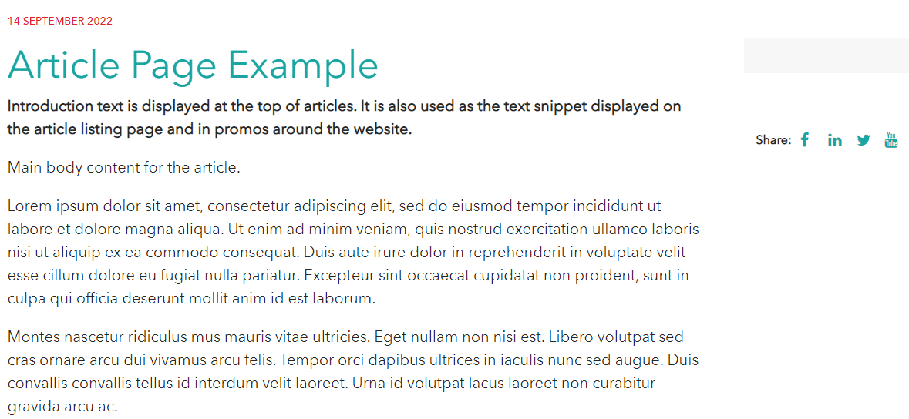
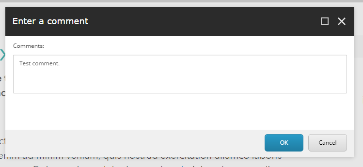

# Content Creator

1. Login to your Lighthouse XP Demo instance.
2. Copy password for user "Minnie" (content author).
> 

3. Click the "Content Management" link.
> 

4. Fill in the fields of the "Log in" form and click the "Log in" button.
> 

5. Click the "Experience Editor" tile.
> 

6. Expand the arrow in the "Warnings" tile.
> 

7. You will see that Minnie cannot edit this item, because she doesn't have an access to it.
> 

8. Expand the arrow near the "Home" section in the breadcrumb and click the "Articles" tile.
> 

9. Click the "Go" button in the breadcrumb.
> 

10. To add the new article, toggle the ribbon in the right-top corner of the page.
> 

11. Click the "Insert page" icon in the "Home" tab.
> 

12. You will see an "Insert Item" pop-up window, fill in the "Name" field and click the "OK" button.
> 

13. The new article has been created, you can update the content and images, if you want.
> 

14. To submit this article for review of content approver, click the "Submit" button.
> 

15. You will see the "Enter a comment" pop-up window, leave comments in the "Comments" field and click the "OK" button.
> 

This scenario shows how content author can easily create the content and submit it for review.
