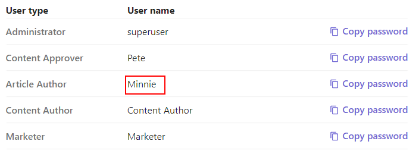
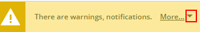
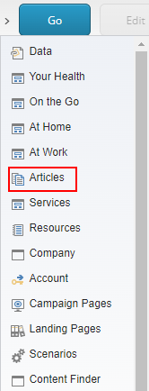
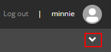
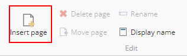

# Content Creator

This scenario shows how content author can easily create the content and submit it for review.

1. Go to your instance details page <https://portal.sitecoredemo.com/instance/{{demoId}}>.

1. Copy password for user "Minnie" (content author).

1. Go to the [Sitecore Launchpad](https://{{demoName}}-cm.sitecoredemo.com/sitecore/login).

1. Fill in the fields of the "Log in" form and click the "Log in" button.

1. Click the "Experience Editor" tile.

1. Expand the arrow in the "Warnings" tile.

1. You will see that Minnie cannot edit this item, because she doesn't have an access to it.

1. Expand the arrow near the "Home" section in the breadcrumb and click the "Articles" tile.

1. Click the "Go" button in the breadcrumb.

1. To add the new article, toggle the ribbon in the right-top corner of the page.

1. Click the "Insert page" icon in the "Home" tab.

1. You will see an "Insert Item" pop-up window, fill in the "Name" field and click the "OK" button.

1. The new article has been created, you can update the content and images, if you want.

1. To submit this article for review of content approver, click the "Submit" button.

1. You will see the "Enter a comment" pop-up window, leave comments in the "Comments" field and click the "OK" button.

