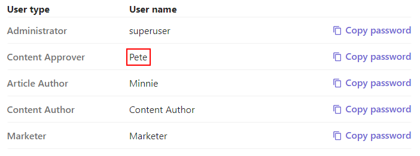

# Approving Content

This scenario shows how the updated content can be easily reviewed and approved by the content approver.

1. Copy password for "Pete" user.

1. Go to the [Sitecore Launchpad](https://{{demoName}}-cm.sitecoredemo.com/sitecore/login).

1. Log in as Pete.

1. Go to the [Mail Server](https://{{demoName}}-smtp.sitecoredemo.com).

1. You will see the message telling you, that you have an item awaiting approval, click on it.

1. There is a mesage, that the item was submitting for approval by content author (Minnie). Click the "Sitecore Workbox" link to approve this item.

1. Scroll down the "Workflows" window and set the "Demo Workflow" checkbox.

1. You will see 3 items awaiting approval.

1. Click the "Approve" button under the "Article Page Example" item.

1. You will see the "Enter a comment" pop-up window, leave comments in the "Comments" field and click the "OK" button.

1. Our article has disappeared from the "Demo Workflow" tab.

1. You have received the mail, that Minnie's article was approved by Pete as well.

