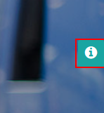
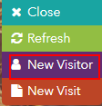
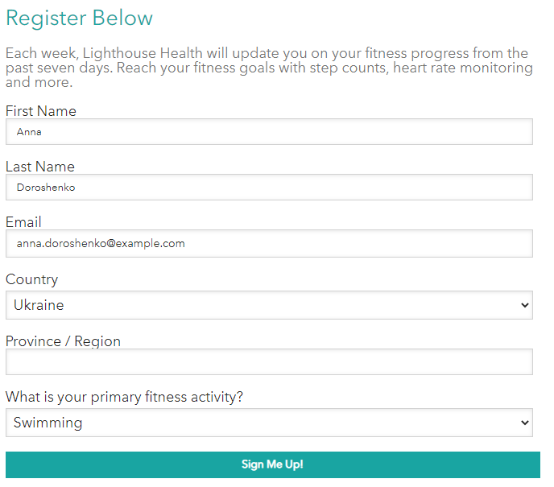
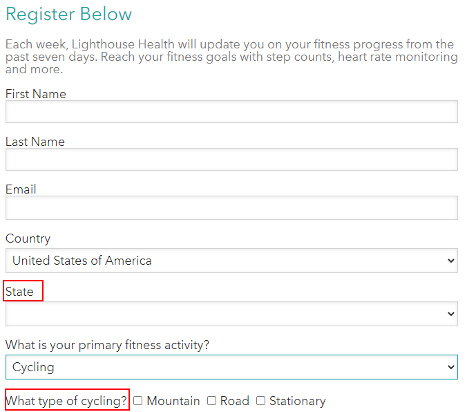

# Dynamic Form Fields functionality

1. Login to your Lighthouse XP demo instance.
2. Click the "Content Delivery" link.

3. Open visit details panel.

4. Start fresh as a new visitor to clear all analytics and session cookies by clicking the "New Visitor" button.

5. Scroll down the page to "Activate Your Fitness Tracker" section and click the "Activate Here" button.

6. You will see the "Register Below" form.

7. Fill out all fields and notice that there is only one "Province/Region" field under the "Country" field and ther are no fields under the "What is your primary fitness activity?" field.

8. If you select another "Country" field and/or "What is your primary fitness activity?" field, you will see another "State" field and additional "What type of cycling?" field.

9. Go ahead and submit the form.

This scenario shows the dynamic form fields functionality in Lighthouse demo.