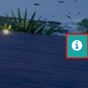
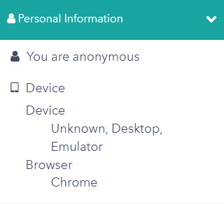
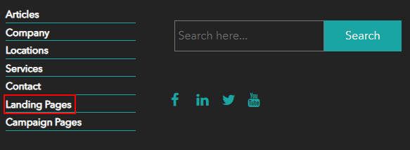
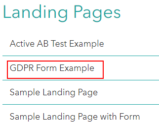
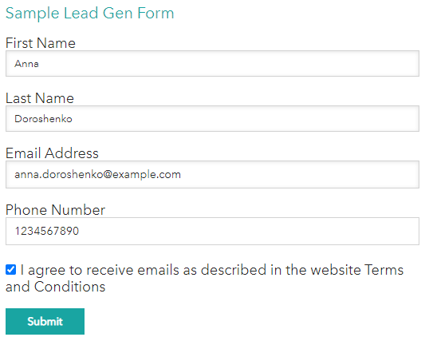
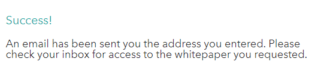

## Form Consent Example

1. Open the front-end of the website in the new incognito window.
2. Open visit details panel.
> 

3. Click the "Personal information" tab and you will see that you are anonymous for now.
> 
> 
4. Close the visit detail panel and scroll down to the bottom of the page.
5. Click the "Landing Pages" section.
> 

6. Choose the "GDPR Form Example" landing page.
> 

7. Fill in the fields of the "Sample Lead Gen Form", set the checkbox to agree and click the "Submit" button.
> 

8. You will see the notification that an email has been sent to address you entered.
> 

9. Open the visit details panel, click the "Personal Information" tab and you will see the updated information there.
> 

This scenario shows how visitor's information can be collected and processed.

