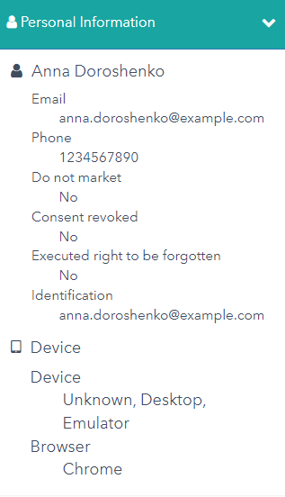

# Form Consent Example

This scenario shows how visitor's information can be collected and processed.

1. Open <https://{{demoName}}.sitecoredemo.com> in the new incognito window.

1. Open visit details panel.

1. Click the "Personal information" tab and you will see that you are anonymous for now.

1. Close the visit detail panel and scroll down to the bottom of the page.

1. Click the "Landing Pages" section.

1. Choose the "GDPR Form Example" landing page.

1. Fill in the fields of the "Sample Lead Gen Form", set the checkbox to agree and click the "Submit" button.

1. You will see the notification that an email has been sent to address you entered.

1. Open the visit details panel, click the "Personal Information" tab and you will see the updated information there.

