# Lighthouse instance features

## Home Page carousel

1. Log in to your Lighthouse XP demo instance.
2. Click the "Content Delivery" service.
> 

3. Go to the new incognito window.
> 

4. You will see the default set of 3 slides on the home page.
> 

5. Click the visit details icon in the right.
> 

6. Click the "Onsite Behavior" tab.
> 

7. You will see, that you have not been profiled yet.
> 
> 
8. Click the "Close" button in the visit details panel.
> 
> 
9. Scroll down to the bottom of the page and click the "Read Now" button on "Sheet Pan Jambalaya" article.
> 
> 
10. Return to the home page and you will see another set of 3 slides with food topic.
> 

11. Click the visit details panel again.
12. Expand the "Onsite Behavior" link and you will see that you were defined as a Foodie persona.
> 

This scenario shows that you can segment your audience to different groups depending on their shown interests.

## Personalized content

1. Open the front-end of the website in the new incognito window.
2. Scroll down the page and click the "Start Here" button in the "Multi-Step Form" section.
> 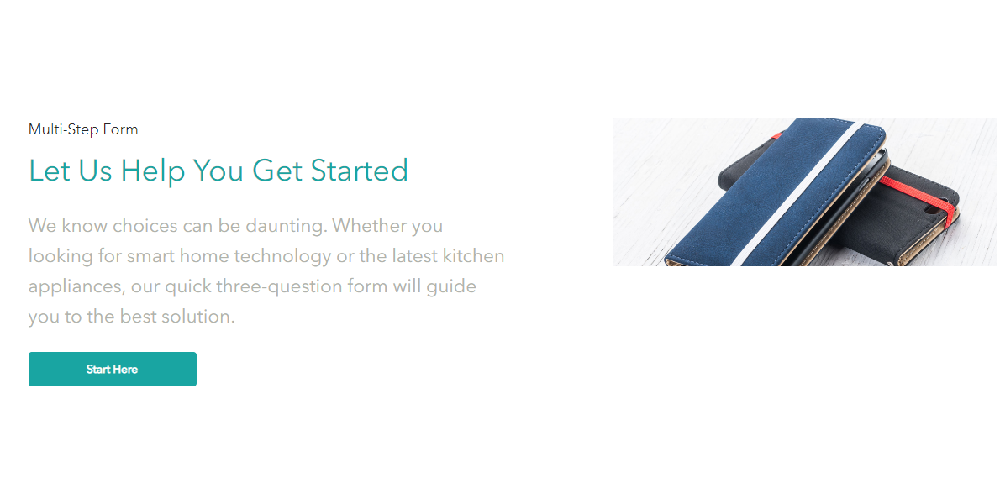

3. Choose the interested icon and click the "Next" button.
> 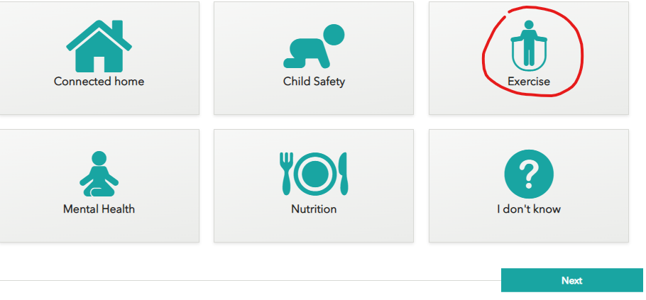

4. Select the preffered "Stage of life" icon and click the "Next" button.
> 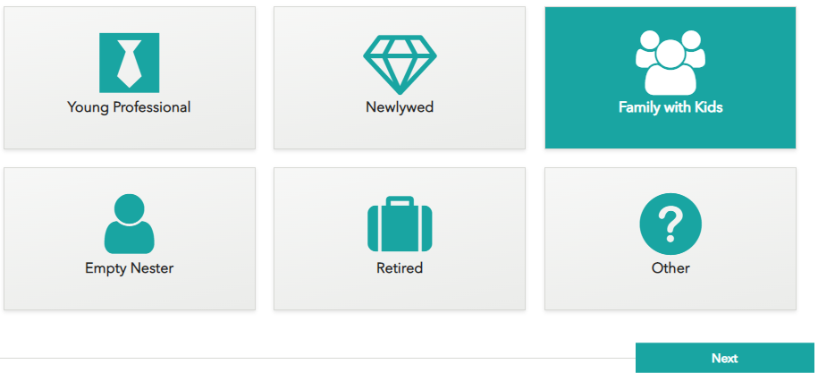

5. Select the type of electronics icon you wish and click the "Next" button.
> 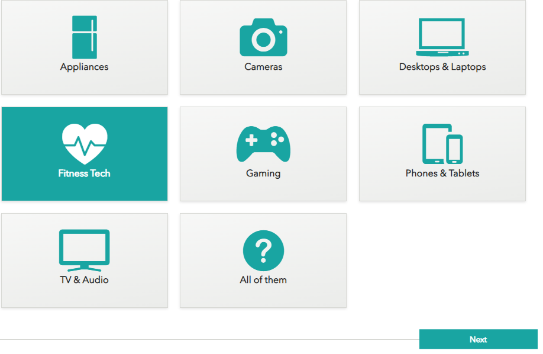

6. You will see the content, recommended for you, based on what answers you have provided in the questionnaire.
   > 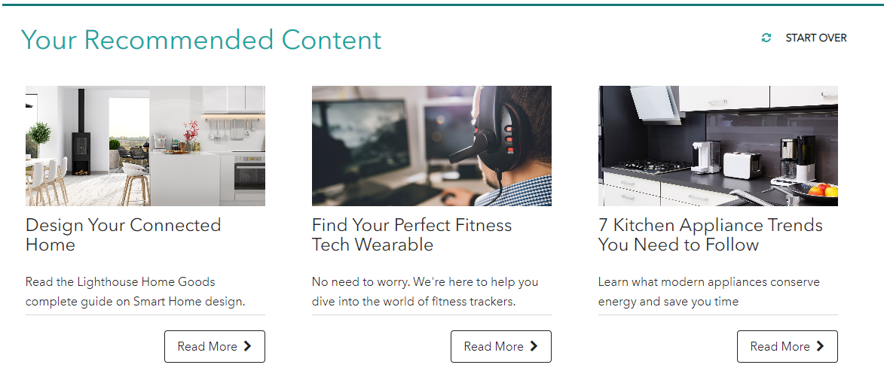

7. Click the visit details panel.
> 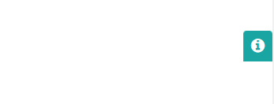  

8. Expand the "Onsite Behavior" link and you will see the updated profiling there with your Health Focus, Stage of Life and Product Interests.
> 

9. Return to the home page and you will see the personalized banner there.
> 
> 

This scenario shows that the provided information in the questionnaire helps you to personalize your website and promote products to your audience based on their interests.

## Form consent example

1. Open the front-end of the website in the new incognito window.
2. Open visit details panel.
> 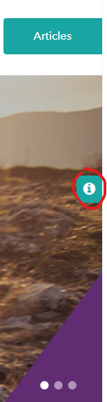

3. Click the "Personal information" tab and you will see that you are anonymous for now.
> 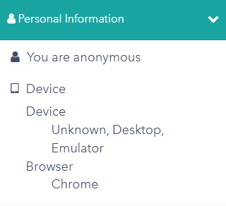
> 
4. Close the visit detail panel and scroll down to the bottom of the page.
5. Click the "Landing Pages" section.
> 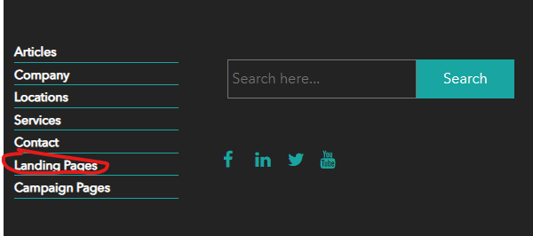

6. Choose the "GDPR Form Example" landing page.
> 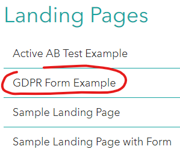

7. Fill in the fields of the "Sample Lead Gen Form", set the checkbox to agree and click the "Submit" button.
> 

8. You will see the notification that an email has been sent to address you entered.
> 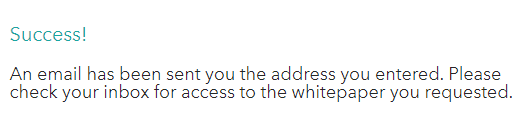

9. Open the visit details panel, click the "Personal Information" tab and you will see the updated information there.
> 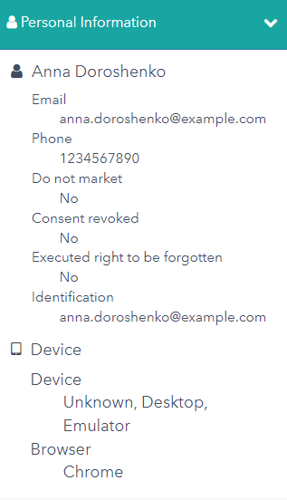

This scenario shows how visitor's information can be collected and processed.

