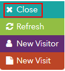

# Home Page Carousel

1. Log in to your Lighthouse XP demo instance.
2. Click the "Content Delivery" service.

3. Go to the new incognito window.

4. You will see the default set of 3 slides on the home page.

5. Click the visit details icon in the right.

6. Click the "Onsite Behavior" tab.

7. You will see, that you have not been profiled yet.

> 
8. Click the "Close" button in the visit details panel.

> 
9. Scroll down to the bottom of the page and click the "Read Now" button on "Sheet Pan Jambalaya" article.

> 
10. Return to the home page and you will see another set of 3 slides with food topic.

11. Click the visit details panel again.
12. Expand the "Onsite Behavior" link and you will see that you were defined as a Foodie persona.

This scenario shows that you can segment your audience to different groups depending on their shown interests.