# Personalized campaigns

1. Log in to your Lighthouse XP instance.
2. Go to the website.
3. Scroll down the page and click the "Campaign Pages" link in the footer.
> 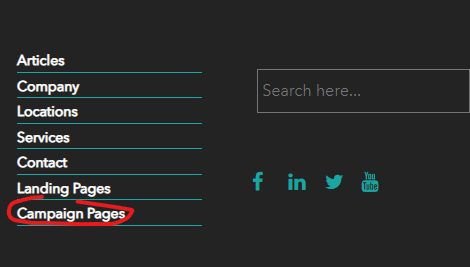

4. Open the visit details panel.
>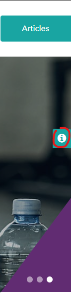

5. Click the "New visitor" button or open this website in incognito mode.
>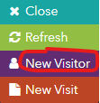

6. Click the "Bing Smart Home Gym" campaign.
> 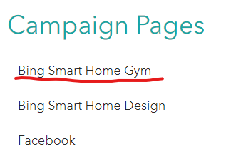

7. You will see the list of websites. Click the first one, making sure you switched off your AD blocker.
>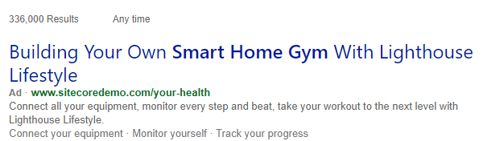

8. It will bring you to the website with fitness related content.
>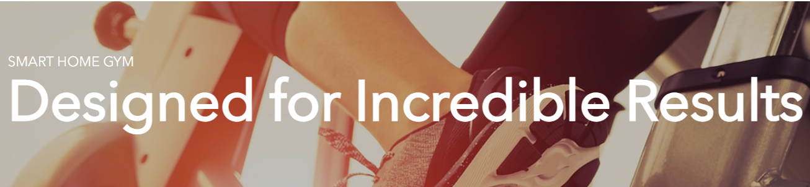

9. Open the visit details panel again and click the "Referral" tab.
> 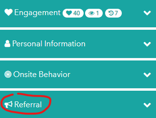

10. You will see the details of current campaign there.
> 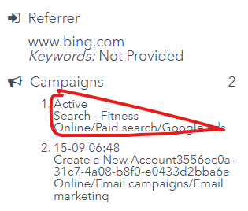 

11. Open the visit details panel and click the "New visitor" button.
> 

12. Click the "Campaign Pages" link again and choose the "Facebook" campaign page.
> 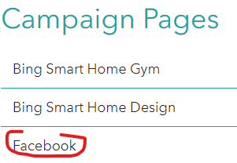

13. You will see the sponsored post. Click on it.
> 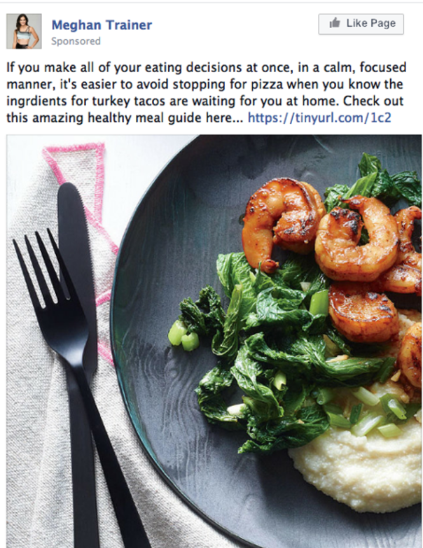

14. It will bring you to the website with food related content.
> 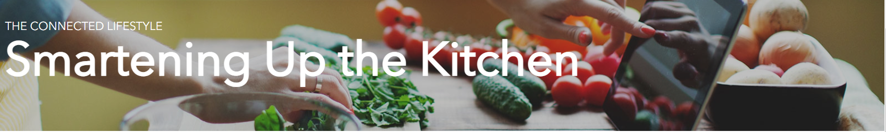

15. Open the visit details panel, click the "Referral" tab again and you will see the details of current campaign.
> 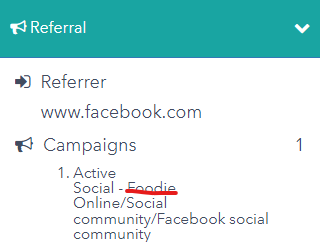

16. Return to your Lighthouse XP demo instance and click the "Content Management" link, use "superuser" name and its password.
> 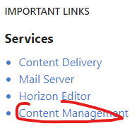

17. Click the "Launchpad" icon in the left-top corner of the page.
> 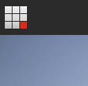

18. Click the "Experience Editor" tile in the "Content Editing" section.
> 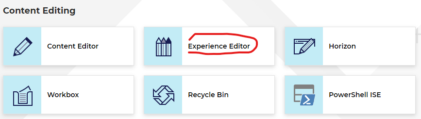

19. Choose "Your Health" page in the breadcrumb path.
> 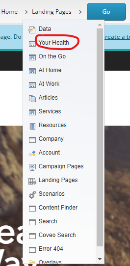

20. Click the "Go" button.
> 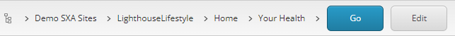

21. You will see the "Your Health. Your Way" banner. Click under these words, choose "Personalization" icon in the left-top corner of the "Title" pop-up window.
> 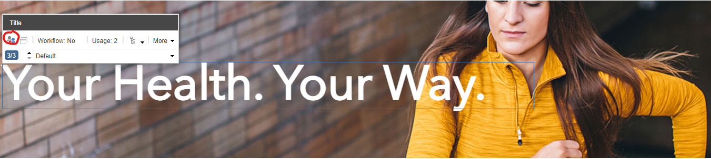

22. You will see the "Personalize the component" pop-up window, where you can read the specific conditions to run the personalized campaign.
> 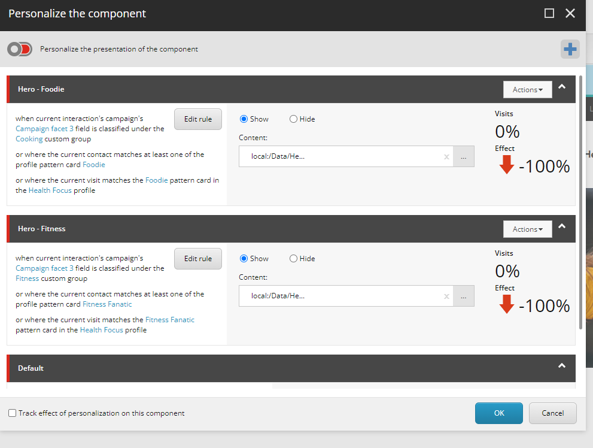

This scenario shows how you can provide the personalized content to your customers, based on their interests.