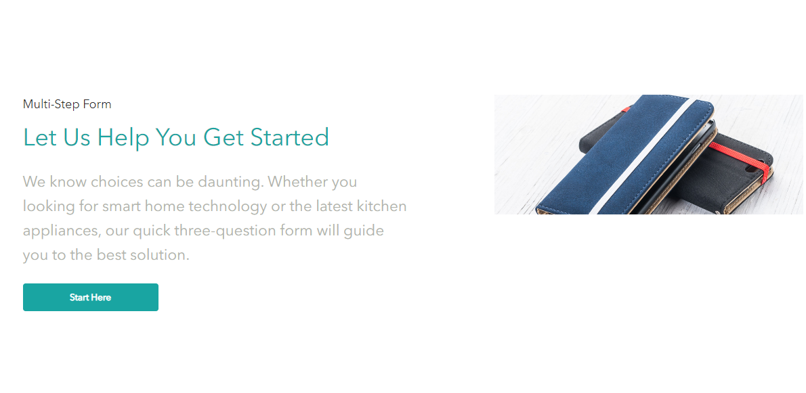
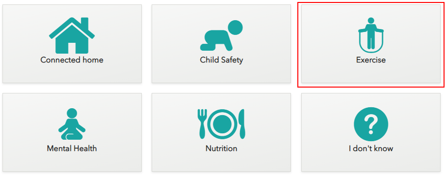
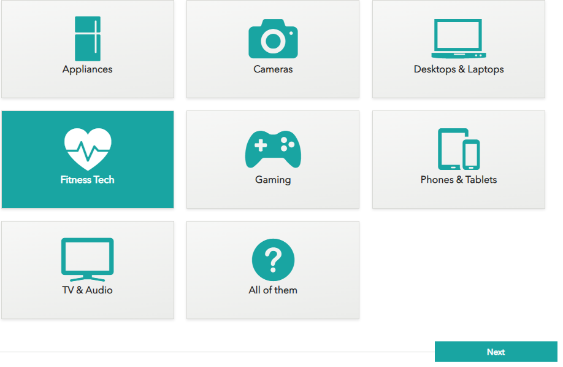

# Questionnaire Personalization

1. Open the front-end of the website in the new incognito window.
2. Scroll down the page and click the "Start Here" button in the "Multi-Step Form" section.
> 

3. Choose the interested icon and click the "Next" button.
> 

4. Select the preffered "Stage of life" icon and click the "Next" button.
> 

5. Select the type of electronics icon you wish and click the "Next" button.
> 

6. You will see the content, recommended for you, based on what answers you have provided in the questionnaire.
   > 

7. Click the visit details panel.
>   

8. Expand the "Onsite Behavior" link and you will see the updated profiling there with your Health Focus, Stage of Life and Product Interests.
> 

9. Return to the home page and you will see the personalized banner there.
> 
> 

This scenario shows that the provided information in the questionnaire helps you to personalize your website and promote products to your audience based on their interests.