# Personalized campaigns

This scenario shows how you can provide the personalized content to your customers, based on their interests.

1. Open <https://{{demoName}}.sitecoredemo.com> in the new window.

1. Scroll down the page and click the "Campaign Pages" link in the footer.
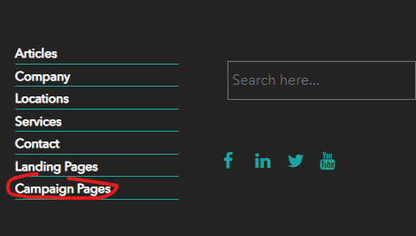

1. Open the visit details panel.
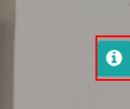

1. Click the "New visitor" button or open this website in incognito mode.
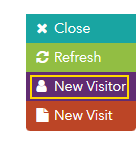

1. Click the "Bing Smart Home Gym" campaign.
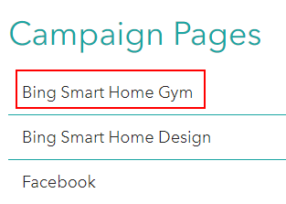

1. You will see the list of websites. Click the first one, making sure you switched off your AD blocker.
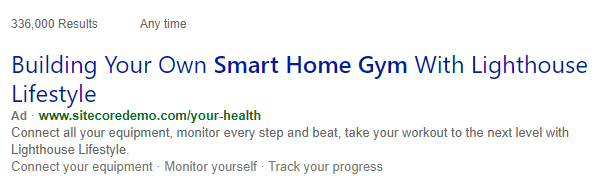

1. It will bring you to the website with fitness related content.
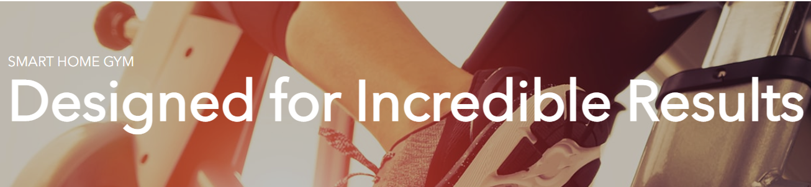

1. Open the visit details panel again and click the "Referral" tab.
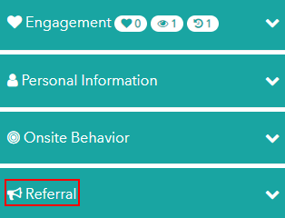

1. You will see the details of current campaign there.
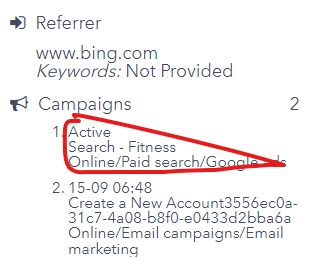 

1. Open the visit details panel and click the "New visitor" button.

1. Click the "Campaign Pages" link again and choose the "Facebook" campaign page.
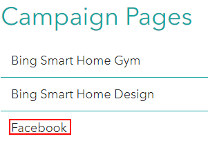

1. You will see the sponsored post. Click on it.
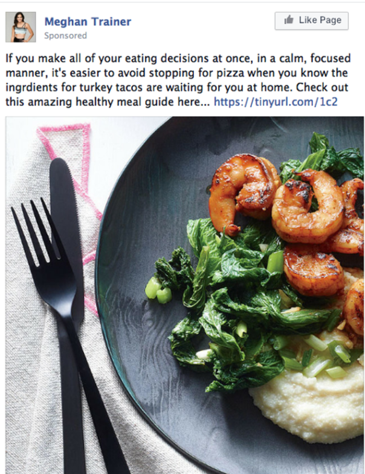

1. It will bring you to the website with food related content.
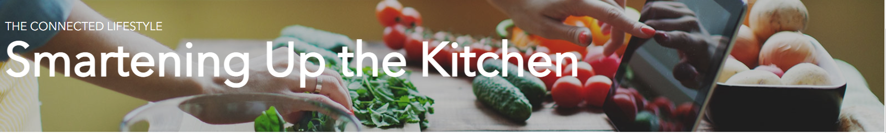

1. Open the visit details panel, click the "Referral" tab again and you will see the details of current campaign.
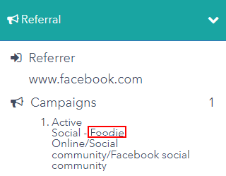

1. Return to your Lighthouse XP demo instance and click the "Content Management" link, use "superuser" name and its password.
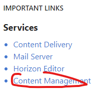

1. Click the "Launchpad" icon in the left-top corner of the page.
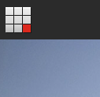

1. Click the "Experience Editor" tile in the "Content Editing" section.
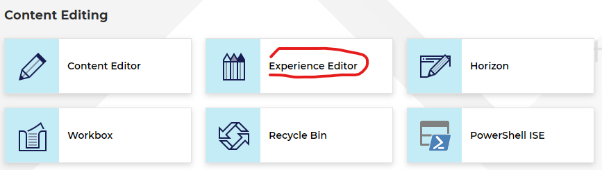

1. Choose "Your Health" page in the breadcrumb path.
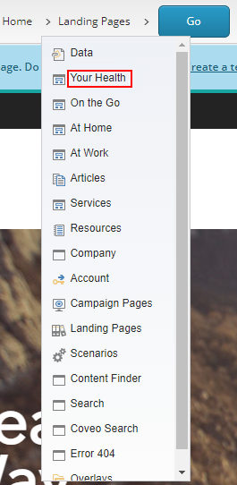

1. Click the "Go" button.
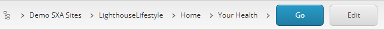

1. You will see the "Your Health. Your Way" banner. Click under these words, choose "Personalization" icon in the left-top corner of the "Title" pop-up window.
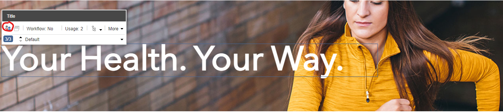

1. You will see the "Personalize the component" pop-up window, where you can read the specific conditions to run the personalized campaign.
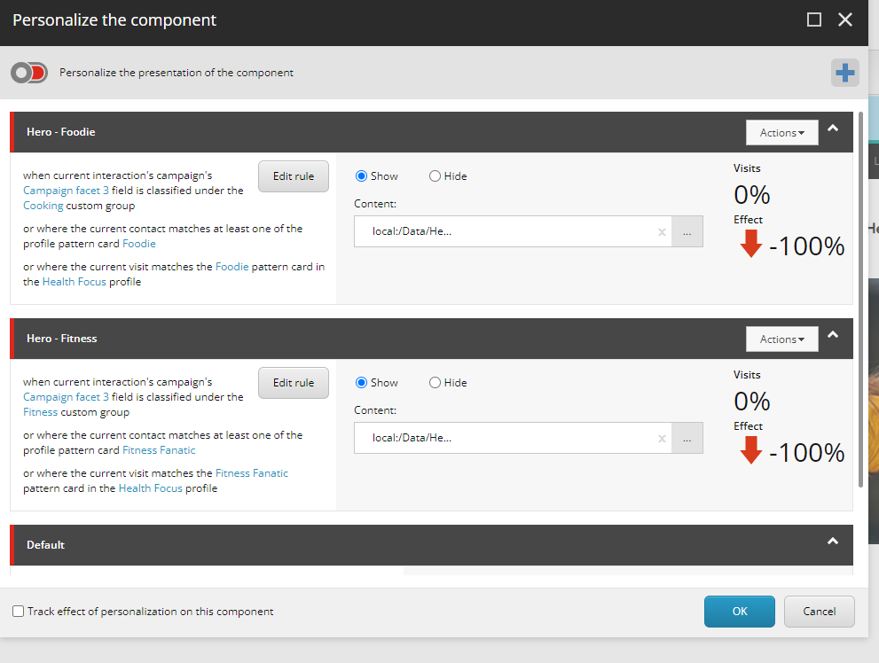
