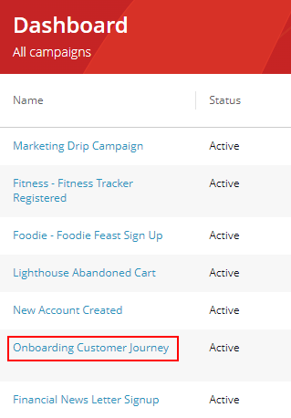
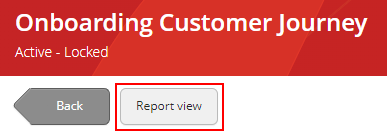
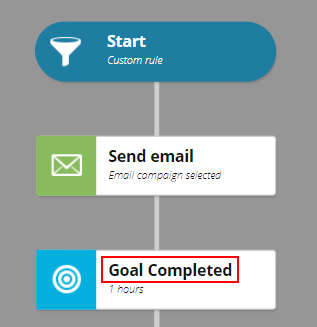

# Customer Journey

1. Go to your Lighthouse XP Demo instance.
2. Open the "Content Delivery" link in incognito mode.

3. Click the "Articles" link.

4. Go to the "Take Cycling to the Next Level" article and click the "Read More" button.
 

5. Scroll down the page, submit the form and click the "Sign Me Up!" button.

6. Open visit details panel.

7. Refresh visit details panel by clicking the "Refresh" button.

8. Click the "Personal Information" tab and you will see your data there.

9. Check your demo inbox.
 

10. You will see the newsletter there.

11.  Click the "Take the test" link in a new incognito window.

12. It will bring you to the "Active AB Test Example" landing page.

13. Open visit details panel again, click the "Personal Information" tab and you will see your data there even in incognito mode.

14. Click the "Engagement" tab and you will see, that you were placed to "Onboarding Customer Journey" engagement plan.

15. To view this automation plan, you should go to the back-end of the website by clicking the "Content Management" link and using "superuser" name and its password.

16. Click the "Launchpad" icon in the left-top corner of the page.

17. Click the "Marketing Automation" application in the "Marketing Applications" section.

18. Click the "Onboarding Customer Journey" campaign in the dashboard.

19. You will see your journey path on the screen.

20. Click the "Report view" button in the left-top corner of the page.

21. You will see yourself in "Goal Completed" step, which can be changed, if you click the "Take the Test" button on the "Active AB Test Example" landing page of the website.

22. Complete the test in inconito mode, choosing interested icons and clicking the "Next" button, and you will see the recommended trainer, depending on your answers in the questionnaire.

23. Return to the "Marketing Automation" application and you will see the updated path of the "Onboarding Customer Journey" campaign. It has been shown, that you completed the "Clicked Email Link" step.

24. Check your demo inbox and you will see an email there, prompting you to register. Click the "Register Now" button.

25. You can fill out the "Register" form. Notice, that your "Email" field is already pre-populated.

This scenario shows how we can track our customer's journies on different devices, request more personal information and interact with it.
