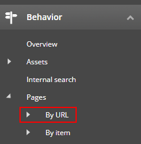
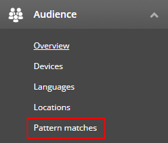

# Experience Analytics

1. Log in to your Lighthouse XP demo instance.
2. Click the "Content Management" link, use "superuser" name and its password.
> 

3. Click the "Launchpad" icon in the left-top corner of the page.
> 

4. Click the "Experience Analytics" application in the "Marketing Applications" section.
> 

5. You will see the Dashboard with demo analytics, populated  for you there.
> 

6. Navigate to the "Behavior" tab and click the "By URL Pages" link.
> 

7. You will see multiple charts with data.
> 

8. Click the "Pattern matches" in the "Audience" tab.
> 

9. You will see how many visitors were profiled depending on their activity on the website.
> 
