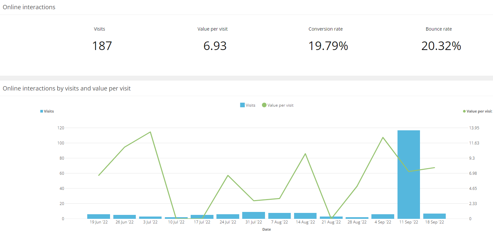

# Experience Analytics

1. Go to the [Sitecore Launchpad](https://{{demoName}}-cm.sitecoredemo.com/sitecore) and login as 'superuser'.

1. Click the "Experience Analytics" application in the "Marketing Applications" section.

1. You will see the Dashboard with demo analytics, populated  for you there.

1. Navigate to the "Behavior" tab and click the "By URL Pages" link.

1. You will see multiple charts with data.

1. Click the "Pattern matches" in the "Audience" tab.

1. You will see how many visitors were profiled depending on their activity on the website.

