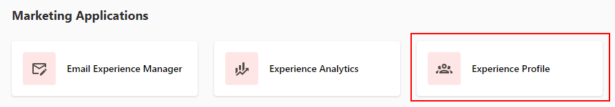
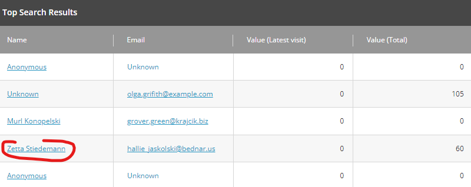
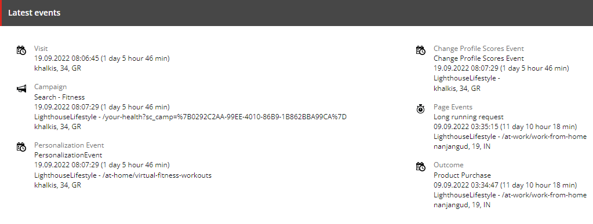
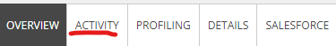
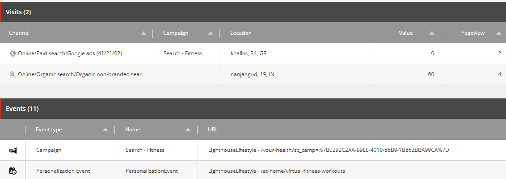
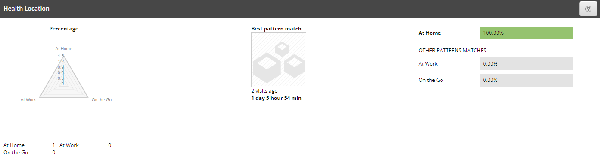

# Experience Profile

1. Click the "Launchpad" icon again.

2. Click the "Experience Profile" application in the "Marketing Applications" section.

3. Click any name from the list to view individual information.

4. You will see all the information of this visitor there.

5. Click the "Activity" tab.

6. You will see quantity of visits and events of this particular customer on the website.

7. Click the "Profiling" tab.

8. You will see the activity of this person there.

This tool shows how to overview the individual information of each visitor and interact with it.
