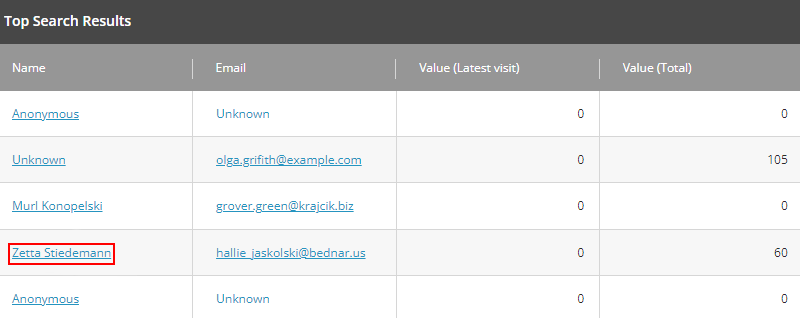
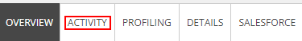

# Experience Profile

Experience Profile allows to review the detailed information about each visitor and interact with it.

1. Go to the [Sitecore Launchpad](https://{{demoName}}-cm.sitecoredemo.com/sitecore).

1. Click the "Experience Profile" application in the "Marketing Applications" section.

1. Click any name from the list to view individual information.

1. You will see all the information of this visitor there.

1. Click the "Activity" tab.

1. You will see quantity of visits and events of this particular customer on the website.

1. Click the "Profiling" tab.

1. You will see the activity of this person there.

