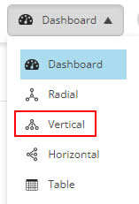
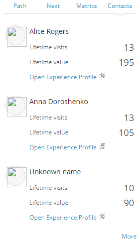
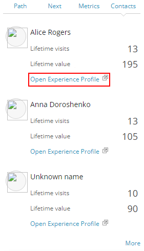

# Path Analyzer

Sitecore Path Analyzer helps to indicate pages with successful conversion rate and understand areas, which need to be improved.

1. Go to the [Sitecore Launchpad](https://{{demoName}}-cm.sitecoredemo.com/sitecore).

1. Click the "Path Analyzer" application in the "Marketing Applications" section.

1. You will see the "Dashboard" view, that gives an opportunity to track customer's journey.

1. Click the "Vertical" view to better visualize customer's path on the website.

1. Click the calendar icon and choose "Last 90 days" reporting view.

1. Click the "Apply" button.

1. You will see the chart there, where green nodes are individual pages in a customer's journey, which have a good conversion rate, and red ones with low conversion rate.

1. You can click on a specific node to see the detailed path overview on the right.

1. Click the "Contacts" tab in the "Selected path overview" section.

1. You will see the contacts' information there.

1. Click the "Open Experience Profile" link to return to the customers' individual information in "Experience Profile" application to improve the outcomes of their journey. 

