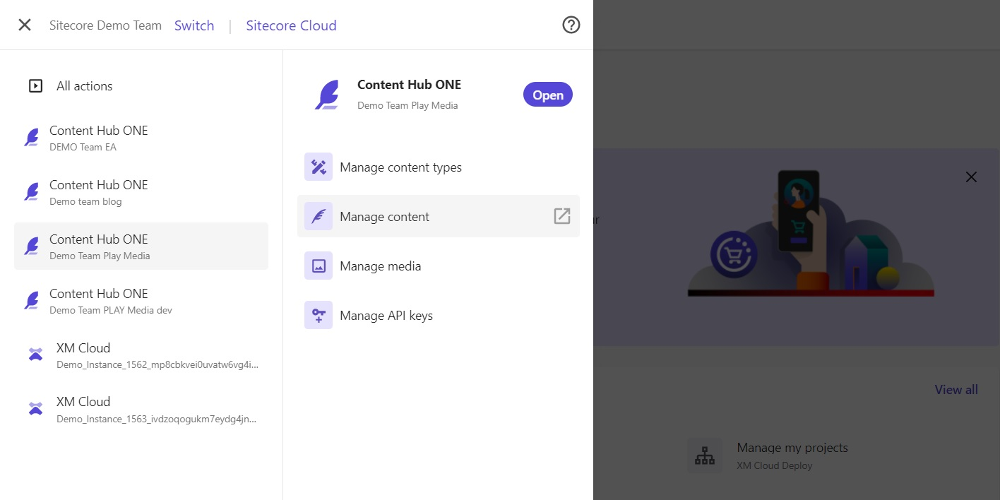
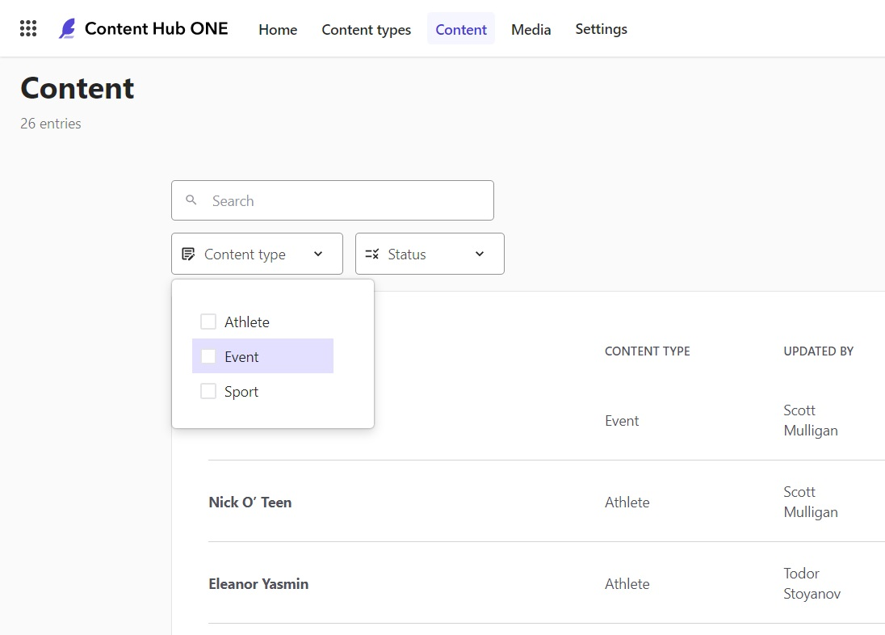
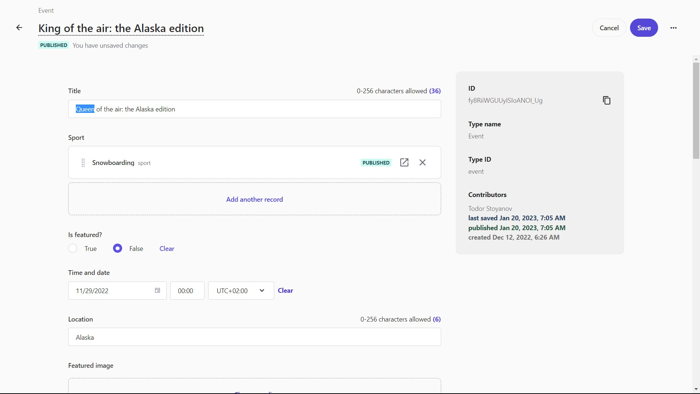
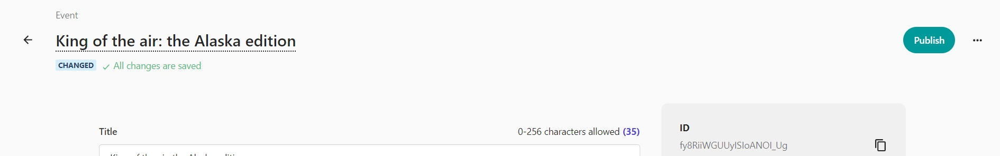
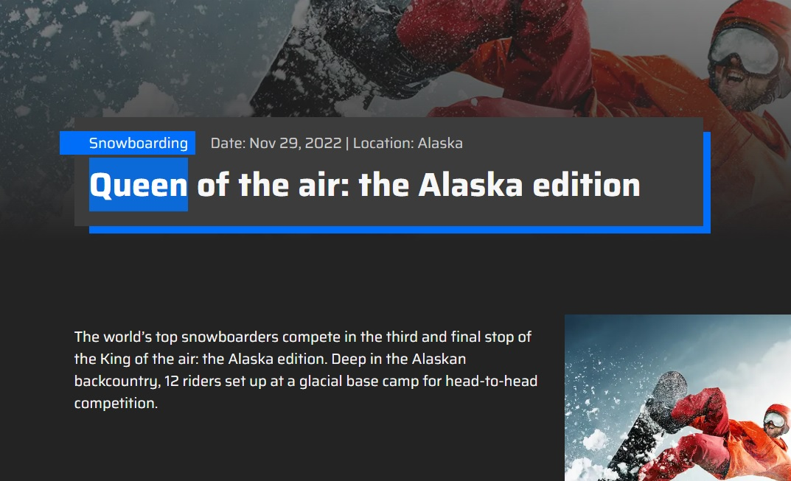

# Update Content

This scenario shows how to update an existing piece of content in Content Hub ONE and publish that change to a web app consuming the content.

1. Log into your the [Sitecore Cloud Portal](https://portal.sitecorecloud.io/) to access your Content Hub ONE instances.

1. Navigate to your Content Hub ONE instance using the left (top corner) navigation menu and select the "Manage Content" link option.

1. Select an existing piece of content to update. You can filter based on content type.

1. Select a field and update text or other content held in that field.

1. After updating a field, click the "Save" button in the top right corner.

1. Don't forget to click the the "Publish" button after the save is complete.

1. Navigate to the [demo web app](https://{{demoName}}-media.sitecoredemo.com) and find the appropriate page to view your content update.

1. Perform a [hard refresh in your web browser](https://www.documate.org/resources/what-is-a-hard-refresh-how-to-do-a-hard-refresh-in-any-browser) to ensure your page content is not cached.

This scenario walk through demostrated how to update an existing piece of content and publish to downstream channels.
