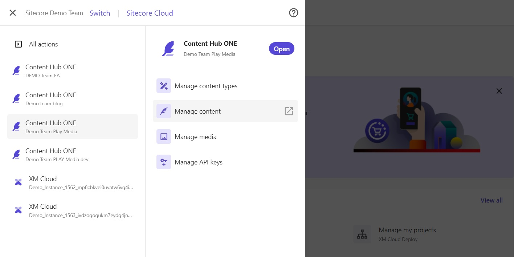
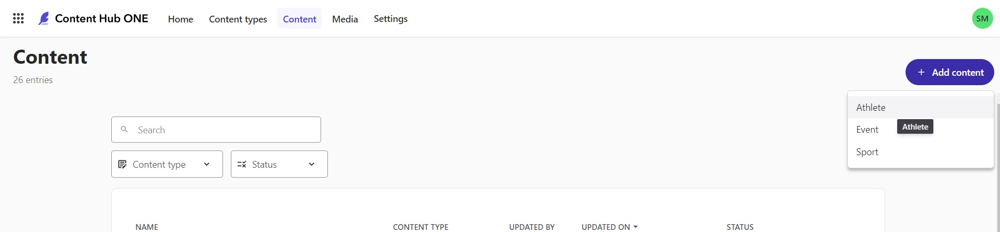
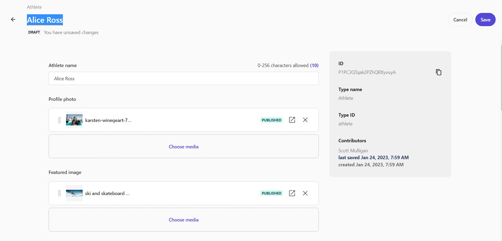
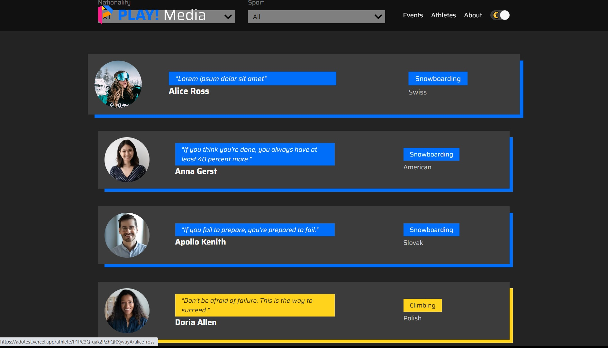

# Create Content

This scenario demonstrates creating and publishing a new piece of content in Content Hub ONE.

1. Log into the [Sitecore Cloud Portal](https://portal.sitecorecloud.io/) to access your Content Hub ONE instances.

2. Navigate to your Content Hub ONE instance using the left (top corner) navigation menu and select the "Manage content" link option.

1. Create a new piece of content by clicking on the **"+ Add content"** button in the top right corner. You can select "Athlete" for this demo scenario.

1. Add content and images to the fields for the new Athlete piece of content. You can attach existing images to image fields instead of uploading new ones if you wish. Don't forget to add a name for your piece of content in the top left section of the browser window (highlighted text in screenshot).

1. Click the **"Save"** button in the top right corner.

2. Click the **"Publish"** button in the top right corner.

3. After your piece of content is published, navigate to the PLAY! Media web app. You can find your new content published to the list of athletes on the "/athletes" page availabe as a link in the top menu.
