# Create Content Types

This scenario demonstrates creating a new content type, creating and publishing new pieces of content in Content Hub ONE, and displaying them on a new page of the website.

There are two ways to create and publish the content types and items needed for this scenario:

1. [Using the Content Hub ONE CLI](#create-and-publish-content-types-and-items-using-the-content-hub-one-cli)
2. [Manually](#manually-create-and-publish-content-types-and-items)

## Create and Publish Content Types and Items Using the Content Hub ONE CLI

To push and publish the content types and items from the serialized files, you must execute these steps from the [Content Hub ONE demo serialization documentation](https://github.com/Sitecore/Sitecore.Demo.CHONE/blob/main/serialization/README.md):

1. Getting Started
1. Connecting a Content Hub ONE instance to the CLI
1. Pushing additional assets to Content Hub ONE (currently ContentBlock and Location)
1. Publishing Content Hub ONE assets

Then you can continue this scenario starting at [Modifying the Code](#modifying-the-code).

## Manually Create and Publish Content Types and Items

**Note:** *Do not execute these steps if you used the Content Hub ONE CLI to create and publish the content types and items.*

1. Log into the [Sitecore Cloud Portal](https://portal.sitecorecloud.io/) to access your Content Hub ONE instances.

2. Navigate to your Content Hub ONE instance using the left (top corner) navigation menu and select the "Manage content types" link option.
   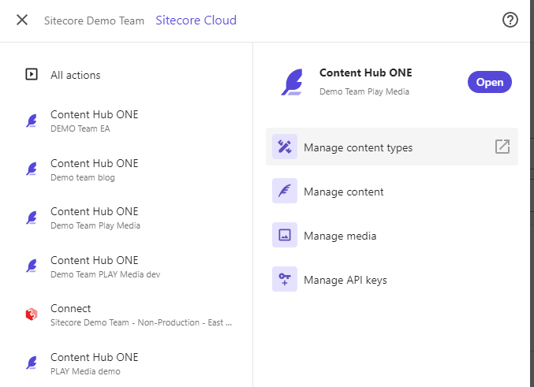

3. Create a new content type by clicking on the **"+ Add type"** button in the top right corner.
   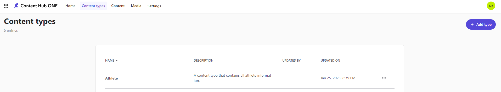

4. Name the new content item **"Content Block"**. Make sure the id field that gets filled out automatically matches the screenshot below, if not rename it to match.
   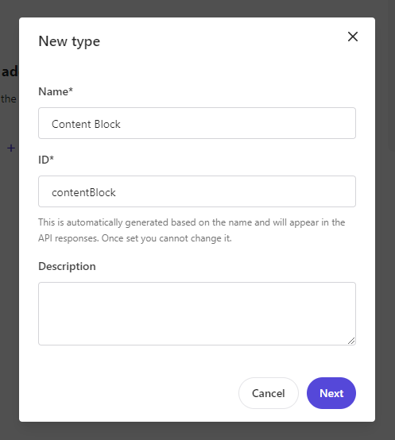

5. Click the **"+ Add field"** button and select **Text**. Name the text field **"Title"**. Make sure the id field that gets filled out automatically matches the screenshot below, if not rename it to match. For Text type select "Long Text".
   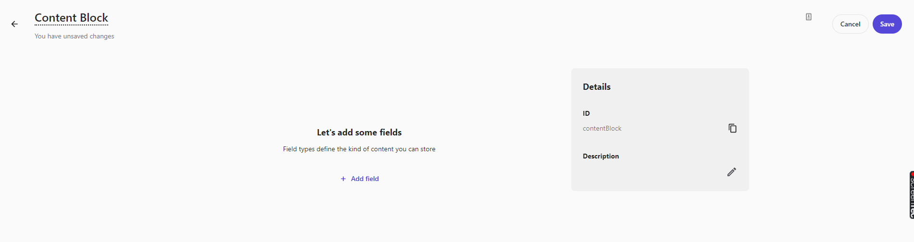
   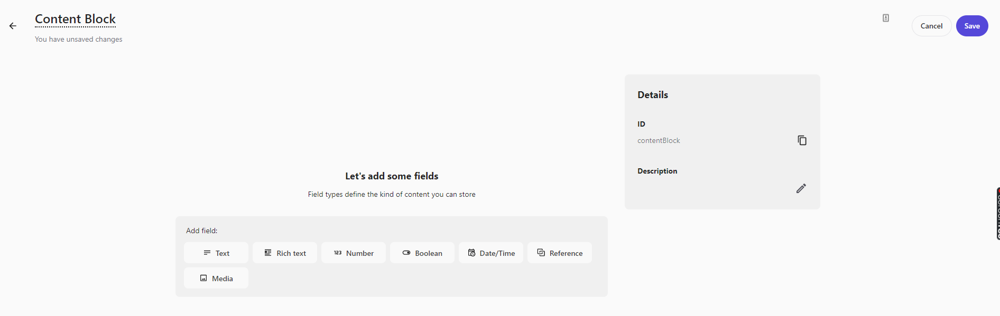
   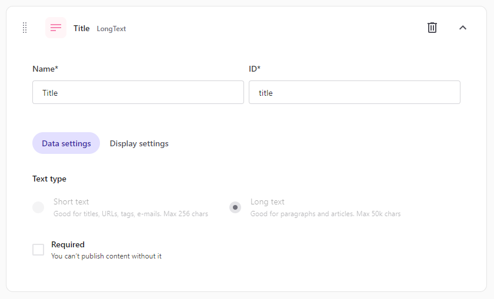

6. Click the **"+ Add field"** button and select **Rich text**. Name the text field **"Body"**. Make sure the id field that gets filled out automatically matches the screenshot below, if not rename it to match.
   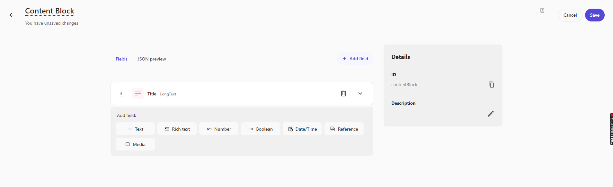
   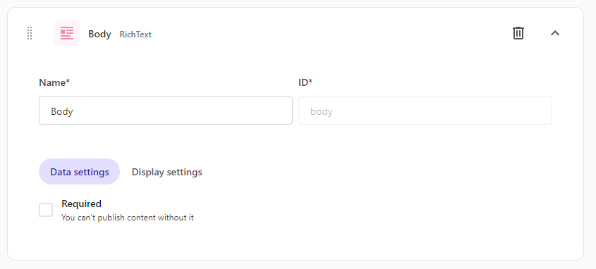

7. Click the **"Save"** button in the top right corner and go back to the content type list.
   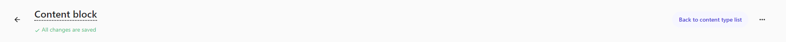

8. Now create another content type following the same steps. Click on the **"+ Add type"** button in the top right corner.
   

9. Name the new content item **"Location"**. Make sure the id field that gets filled out automatically matches the screenshot below, if not rename it to match.
   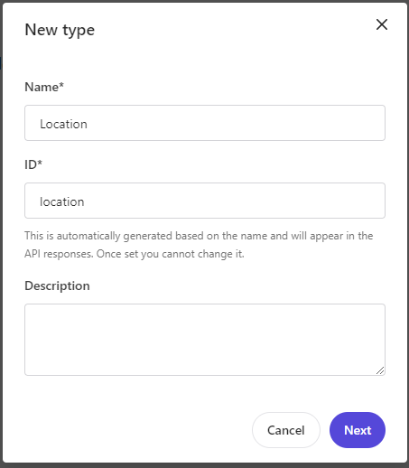

10. Click the **"+ Add field"** button and select **Text**. Name the text field **"Title"**. Make sure the id field that gets filled out automatically matches the screenshot below, if not rename it to match.
    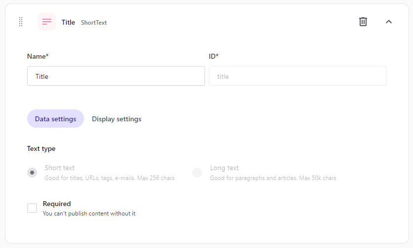

11. Click the **"+ Add field"** button and select **Text**. Name the text field **"Address"**. Make sure the id field that gets filled out automatically matches the screenshot below, if not rename it to match.
    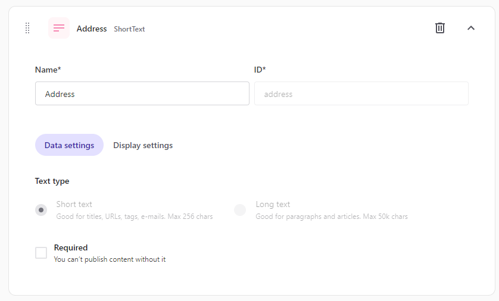

12. Click the **"+ Add field"** button and select **Text**. Name the text field **"City"**. Make sure the id field that gets filled out automatically matches the screenshot below, if not rename it to match.
    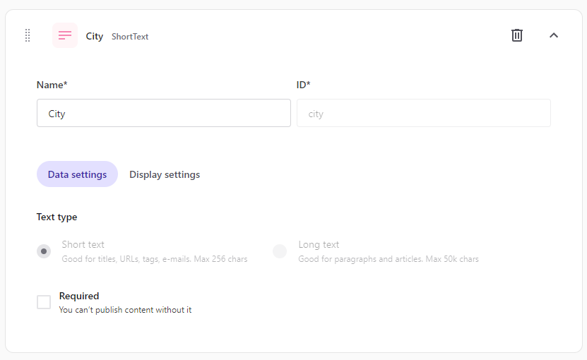

13. Click the **"+ Add field"** button and select **Text**. Name the text field **"Country"**. Make sure the id field that gets filled out automatically matches the screenshot below, if not rename it to match.
    

14. Click the **"+ Add field"** button and select **Text**. Name the text field **"Phone"**. Make sure the id field that gets filled out automatically matches the screenshot below, if not rename it to match.
    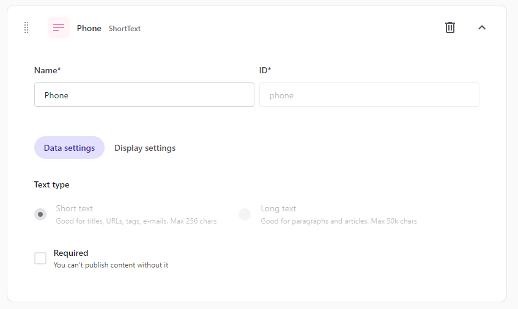

15. Click the **"Save"** button in the top right corner and go back to the content type list.

16. Go to the Content section. Create a new piece of content by clicking on the **"+ Add content"** button in the top right corner. Select "Content Block". We will create three Content Blocks in total.
    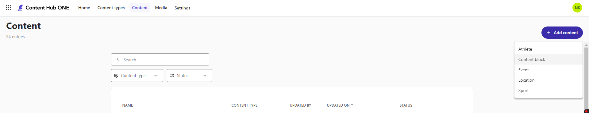

17. Use the following to fill out your first content item:

    - Name and Title

      > The go-to source for sports news

    - Body

      > An outstanding team of journalists is available 24/7 to ensure you never miss a performance of your favorite athlete. With us, you will discover many new items every day and make them available using the best and latest technology.
      >
      > Our goal is to provide interesting, current, and reliable information about sports. We are always on-site at the event and monitor it for you. It doesn't matter to us whether it's a local tournament or a world championship. If your favorite team or athlete is in it, we're there broadcasting for you.
      >
      > Every fan can find something for themselves: news, commentary, analysis, statistics, and interviews with some of the most interesting personalities in sports - athletes, coaches, and fans.
      >
      > Our services include providing packages of sports information categorized by topic and consisting of news, commentary, analysis, and live scores.

18. Once you're done click **Save** and **Publish**. Your item should look something like the following screenshot (the ID will be different and that is OK). Next you can go back to the content list.
    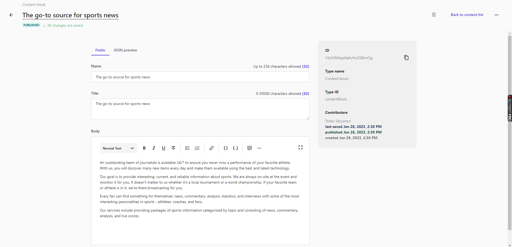

19. Repeat steps 16 to 18 to create another content item. Use the following content:

    - Name and Title

      > The PLAY! Media History

    - Body

      > The **PLAY!** Media magazine was first launched in 1883 as a lightweight publication mostly centered on sports humor, but after it was purchased by John Jonah Jameson Jr. in 1936, it became a crucial weekly sports news publication in the United States focused on sports photojournalism. Until 2000, **PLAY!** Media commissioned more than 120,000 stories and 10 million photographs. Throughout the decades, many generations of photographers passed through the magazine, as well as some of the greatest writers, editors, illustrators, and cartoonists of its time.

20. Repeat steps 16 to 18 to create another content item which will have only a title. Use the following content:

    - Name and Title

      > Our locations

21. Go back to the content list and filter by "Content Block" content type. You should see your three Content Blocks.
    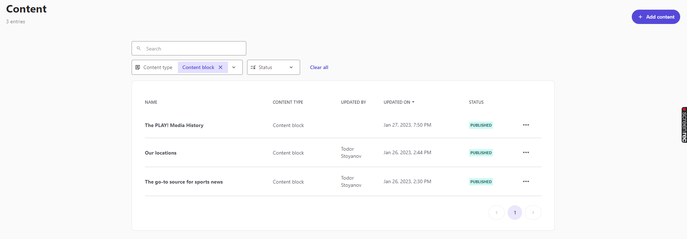

22. Create two location items by clicking on the **"+ Add content"** button in the top right corner and selecting "Location". For each one, click **Save** and **Publish**. Use the following content:
    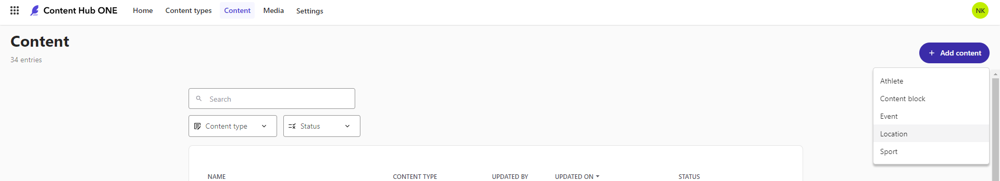

    1. First location item

       - Name and Title

         > America - HQ

       - Address

         > Why Worry Lane

       - City

         > Arizona city

       - Country

         > USA

       - Phone

         > 1 800 123-4567

    2. Second location item

       - Name and Title

         > Europe - HQ

       - Address

         > Ha-Ha Road

       - City

         > London

       - Country

         > United Kingdom

       - Phone

         > 044 773663

23. Go back to the content list and filter by "Content Block" content type. You should see your two Locations.
    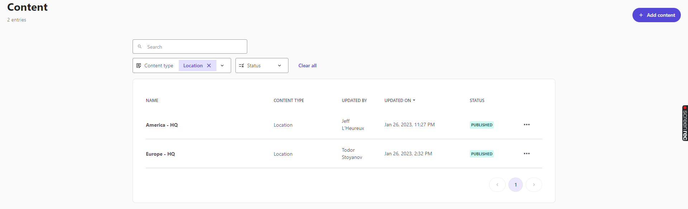

## Modifying the Code

1. Open your PLAY! Media code repository in your editor of choice.
2. Open the `play-media\src\components\Header\Header.tsx` file.
3. Uncomment the "About us" link (lines 53-57) and save.
   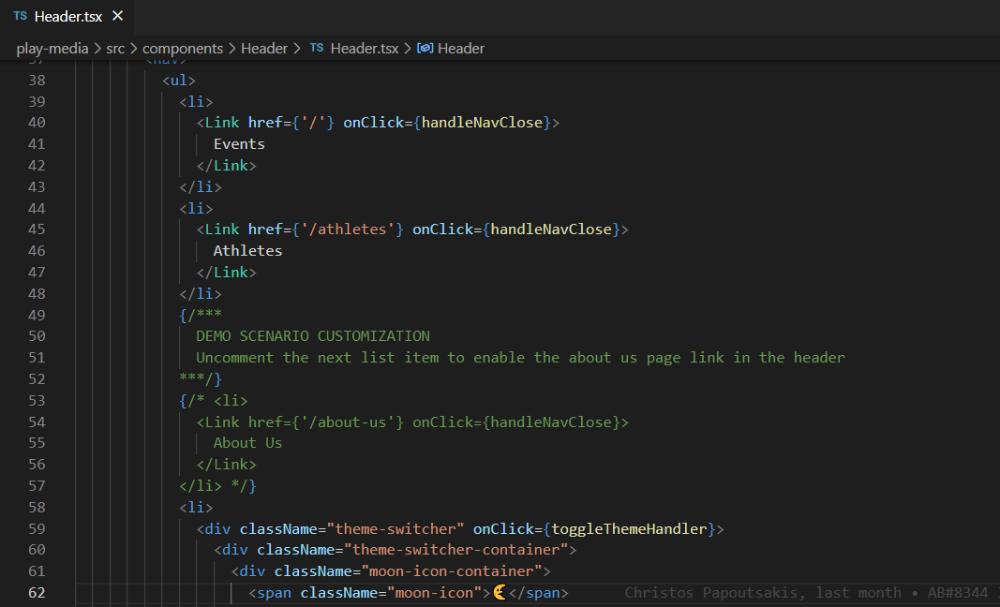

4. In the `play-media\src\pages` folder, rename the `about-us.tsx.demo` file to `about-us.tsx` and open it.
5. If you manually created the content items:
   1. Find `CONTENT_BLOCK_IDS` (line 44).
   2. Change the IDs to match the ones of your Content Block items and save the file.
      - You can find them by going to your content item and looking at the gray box on the right.
        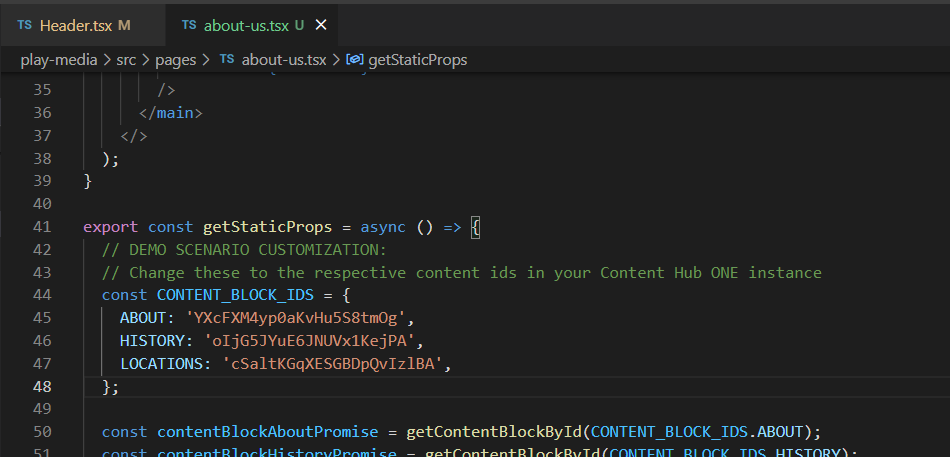
        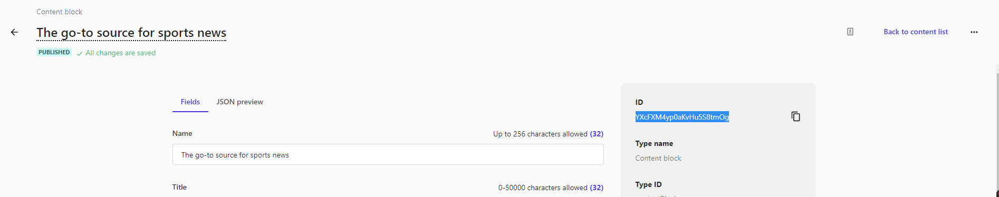

## Showing the Results

- You can show the changes in your local environment. Just save the files (this should reload the site) and show the new page.
- If you are using **your own GitHub repo** you can commit and push the changes. That should trigger a Vercel deployment. Once done, you can show the changes on your Vercel website.
