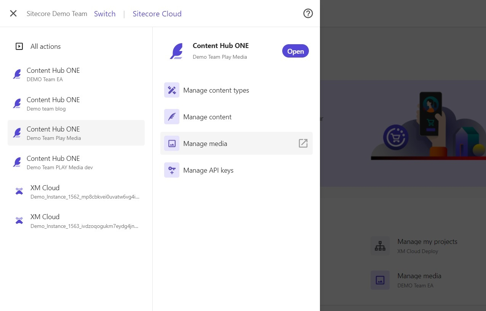
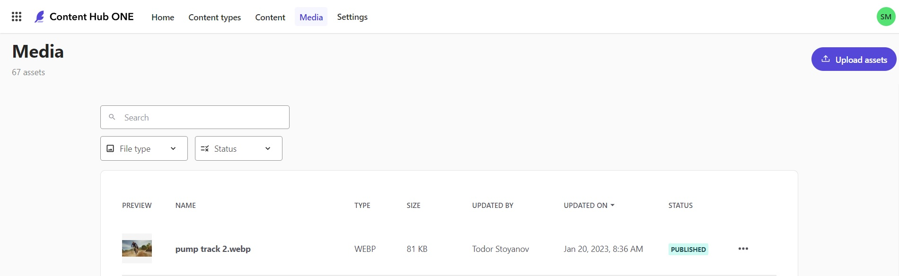
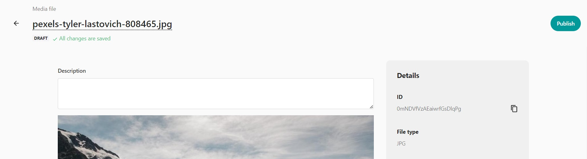
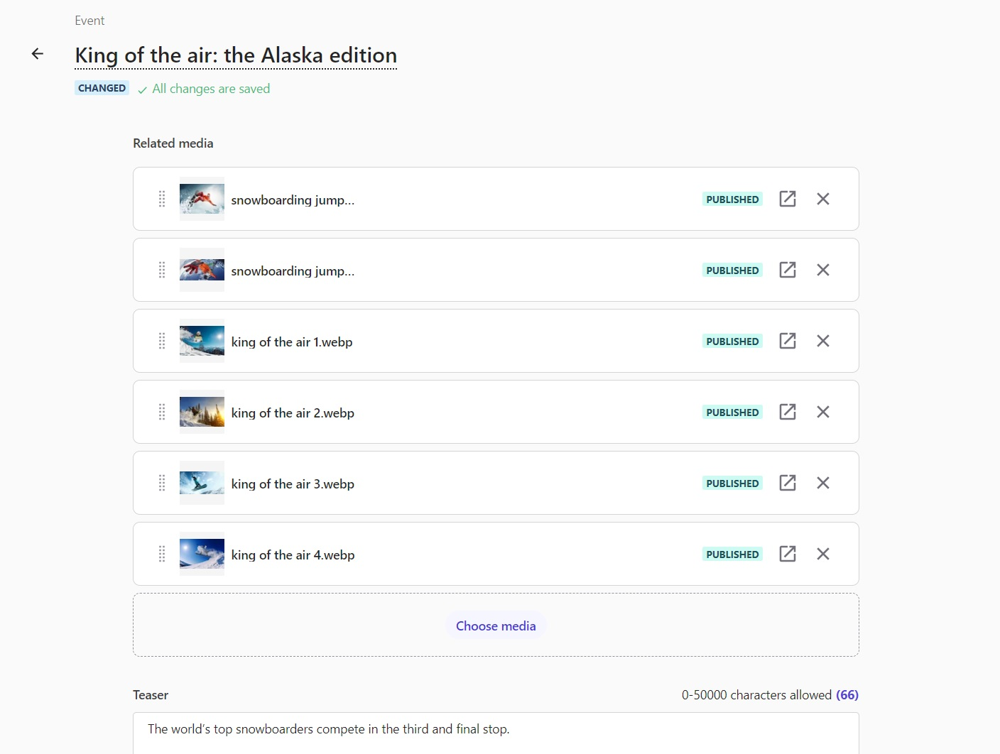
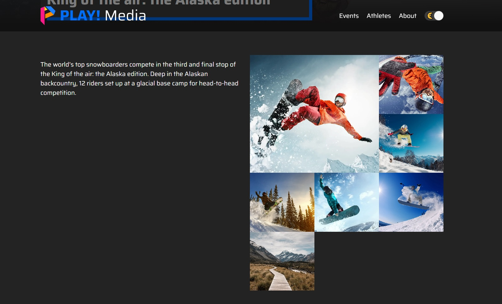

# Upload and Use Images

This scenario demostrates how to upload new images and attach images to image fields in Content Hub ONE.

1. Log into the [Sitecore Cloud Portal](https://portal.sitecorecloud.io/) to access your Content Hub ONE instances.

1. Navigate to your Content Hub ONE instance using the left (top corner) navigation menu and select the "Manage media" link option.

1. You can upload a new media asset by clicking on the "Upload assets" button in the top right corner.

1. Publish your new media asset. Find your media asset in the list and click on it. Click the "Publish" button in the top right corner.

1. Navigate to a new or existing Event. You can click on the "Choose media" button to add one or more assets to an image field. Find and select the image you uploaded and publihsed in a previous step. For example, add your new image to the **"Related media"** field for an Event.

1. Click the **"Save"** button in the top right corner of the Event.

1. Click the **"Publish"** button in the top right corner of the Event.

1. Navigate to the same Event on the PLAY! Media web app. You will be able to see additional images added to the image gallery displayed beside the event description.

You have now succesfully added a new media image to Content Hub ONE and referenced it from a piece of content.
