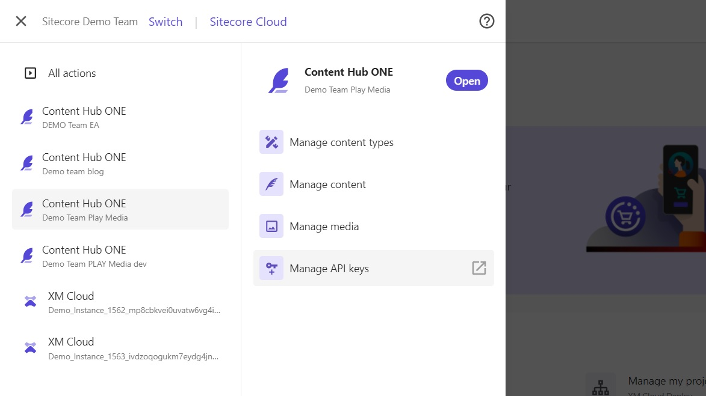
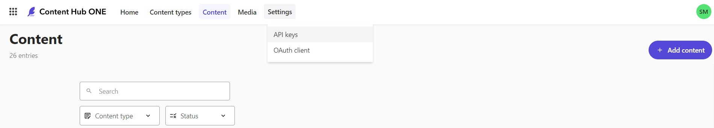
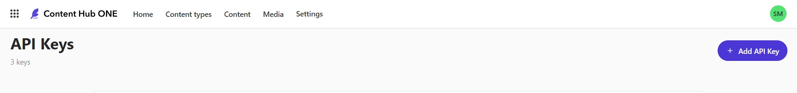
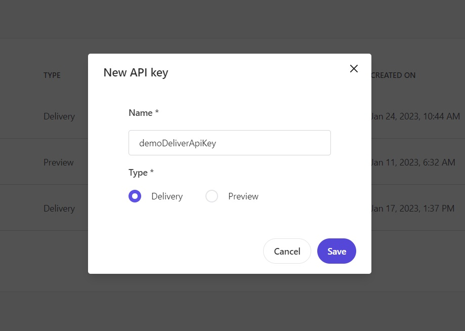
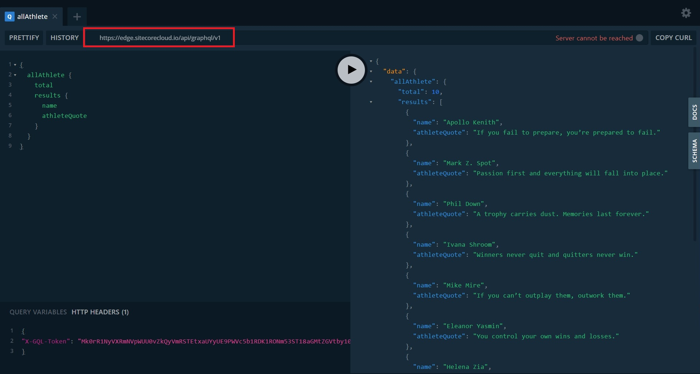
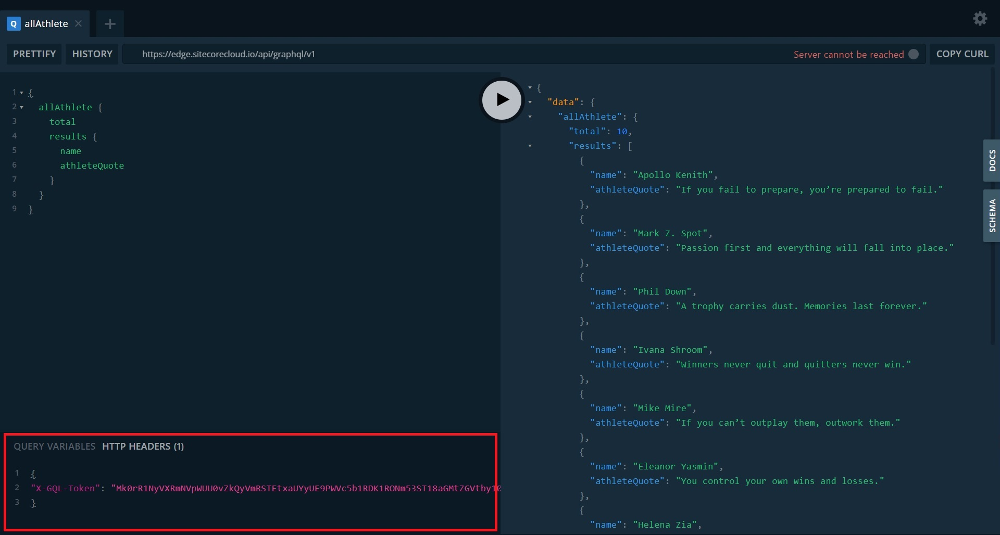
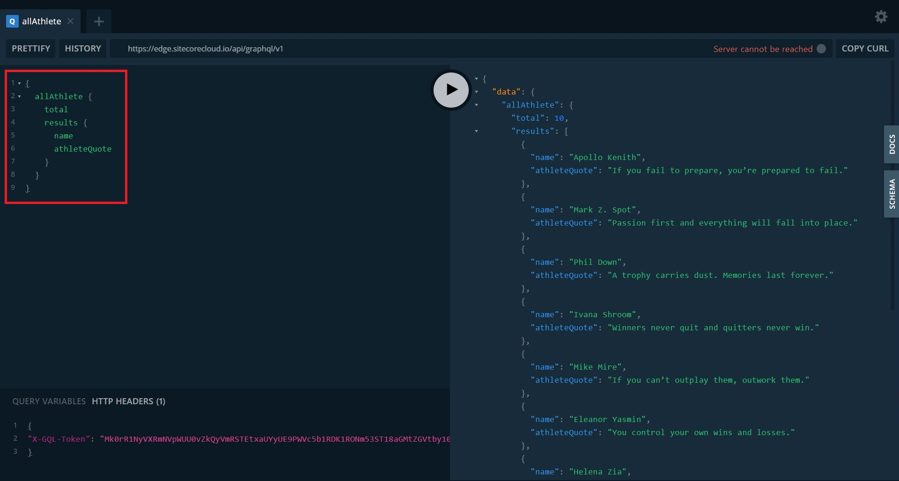
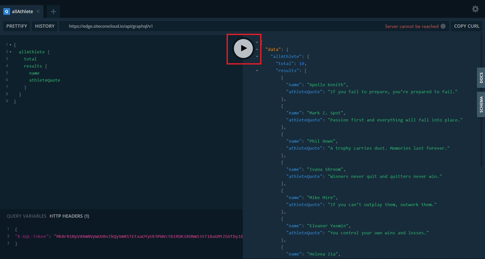

# Consume GraphQL Content

This scenario will demonstrate how to use the built-in GraphQL playground to perform queries against Content Hub ONE and receive content as GraphQL responses.

1. Navigate to the "API Keys" management page in Content Hub ONE. You can access the API Keys page by navigating directly from the Sitecore Cloud Portal or using the "Settings->API Keys" menu option in Content Hub ONE.

    

1. Create a new Delivery API Key by clicking on the **"+ Add API Key"** button in the top right corner.

1. Ensure you select the "Delivery" option when creating the API Key. Copy and save the Delivery API Key that is generated. (**Note:** You can use the Preview API Key but this the GraphQL playground links will differ from this scenario. [More info here about using the Preview API Key.](https://doc.sitecore.com/ch-one/en/developers/content-hub-one/graphql--preview-and-delivery-apis.html))

1. Open the GraphQL playground (also referred to as the "API IDE" in documentation) by opening the following URL in your browser: [https://edge.sitecorecloud.io/api/graphql/ide](https://edge.sitecorecloud.io/api/graphql/ide).

1. After opening the GraphQL playground, ensure the API endpoint is set correctly to: `https://edge.sitecorecloud.io/api/graphql/v1`. (**Note:** The API endpoint URL is different than the browser URL.)

1. Use the Delivery API Key that was generated in a previous step as the **"X-GQL-Token"** that is added to the **HTTP HEADERS** tab at the bottom of the playground window.

    The format for the X-GQL-Token should be:

        {
        "X-GQL-Token": "[YOUR_DELIVERY_API_TOKEN]"
        }

1. Add a GraphQL request such as the following to access content from your Content Hub ONE instance.

    Here is the GraphQL query snippet to copy. [Here are other GraphQL examples for Content Hub ONE](https://doc.sitecore.com/ch-one/en/developers/content-hub-one/graphql--graphql-query-examples.html).

        {
            allAthlete {
                total
                results {
                    name
                    athleteQuote
                }
            }
        }

1. Click on the button in the middle of the playground window to execute the GraphQL query.

While this scenario uses the GraphQL playground to perform queries, the same approach would be done for web apps to consume content and assets from Content Hub ONE.
