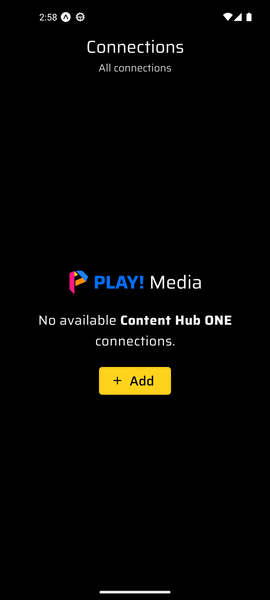
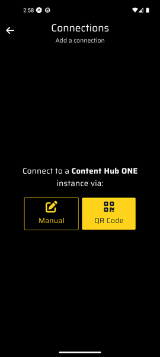
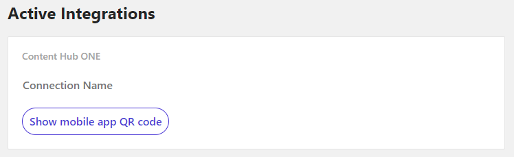
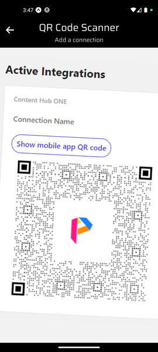
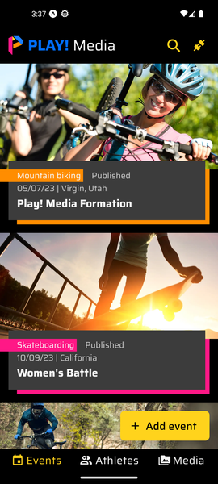
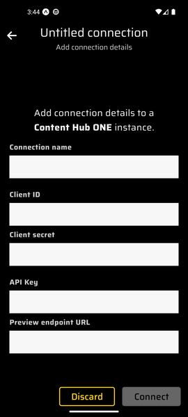
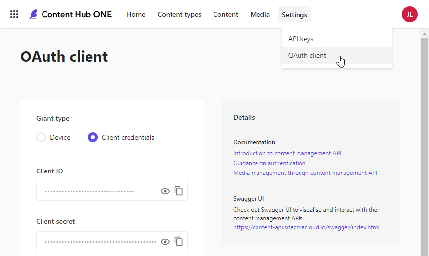
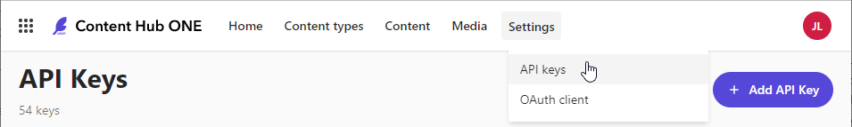
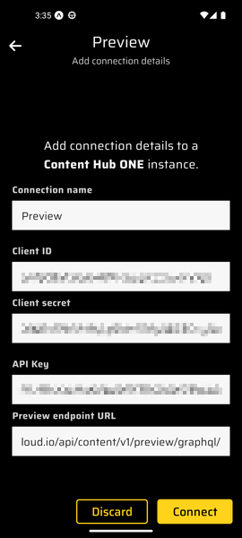

# Connect to a Content Hub ONE Instance

1. Open the PLAY! Media mobile application.
2. In the connection list screen, click the "Add" button.

3. To fill the connection details to your Content Hub ONE instance, you have 2 options:
    1. [Scanning a QR code](#option-1-add-a-connection-by-scanning-a-qr-code)
    2. [Manually enter the connection details](#option-2-manually-add-a-connection)

    

## Option 1: Add a Connection by Scanning a QR Code

This is the easiest option when using a physical phone.

1. On your demo portal instance details page:
    1. Scroll down to the Content Hub ONE integration.
    2. Click on the "Show mobile app QR code" button.
    
2. In the mobile application:
    1. Click the "QR Code" button.
    2. If asked, Allow the application to use your phone camera.

        > **Note:** If you are using a phone emulator, the camera view could be showing green noise instead of your webcam video feed. If that happens, click the back button and click again on the "QR Code" button. You should now see your webcam video feed.

    3. Point your phone camera to the demo portal QR code.

        > **Note:** If you are using a phone emulator and an external webcam, point the webcam to the demo portal QR code on your screen. If you do not have an external webcam, you can print the demo portal QR code and place the printed QR code in front of your integrated computer webcam.

        - If there is any error while validating the connection details or connecting to the Content Hub ONE instance, the error details will be displayed.

        

    4. After the connection is established, you are redirected to the events list screen, and the content of this Content Hub instance is fetched.
    

## Option 2: Manually Add a Connection

This is the easiest option when using a phone emulator.

1. Click the "Manual" button.
2. Fill all the fields using the instructions below:

    - Connection name: Choose a unique name that is not already used by another connection.
    - Client ID: Go to Content Hub ONE instance in the `Settings > OAuth client` section. Choose "Grant type" option named "Client credentials". Get the client ID from the field of the same name.
    

    - Client secret: Go to Content Hub ONE instance in the `Settings > OAuth client` section. Choose "Grant type" option named "Client credentials". Get the client secret from the field of the same name.
    - API Key: Create one in your Content Hub ONE instance in the `Settings > API keys` section. Save it in your notes as it will not be accessible through the Content Hub ONE UI after being created.
    

    - Preview endpoint URL: `https://content-api.sitecorecloud.io/api/content/v1/preview/graphql/`

3. Click the "Connect" button.
    - If there is any error while validating the connection details or connecting to the Content Hub ONE instance, the error details will be displayed below the relevant fields.

    

4. After the connection is established, you are redirected to the events list screen, and the content of this Content Hub instance is fetched.

