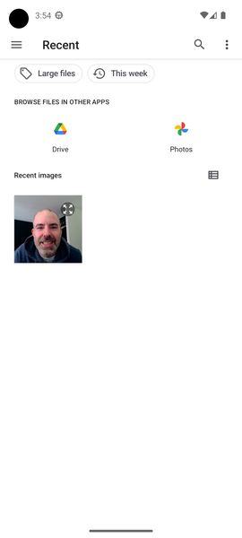
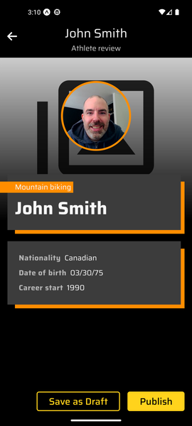

# Create Draft Content

## Adding a New Athlete

1. Open the PLAY! Media mobile application.

1. Go to the athletes listing screen.
1. Click on the "Add athlete" button.

1. Enter a name for the new athlete.

1. Next to the "Sport" field title, click the "Add" button.

1. In the "Select a sport" screen, select the desired sport.

1. Next to the "Profile photo" field title, click the "Add" button.

1. Choose one of the following options:

    1. Camera
        1. If asked, allow the application to use your phone camera.
        1. Take a picture by clicking the camera button.
        
        1. Confirm the picture by clicking the checkmark button.
        
    1. Device:
        1. If asked, allow the application to access your device media.
        1. Select a picture from your device library.
        
1. Adjust the picture to your needs.
1. Click the "Crop" button.

1. Optionally add a title and a description to your new media.

1. Click the "Add Media" button.

1. If you wish, you can stop the scenario at this moment by clicking the "Save Draft" button.

    1. Wait for the new media items and new athlete to be uploaded to Content Hub ONE as draft.
    1. Go to the [Finding the New Athlete and Media Items](#finding-the-new-athlete-and-media-items) section.
1. Otherwise, you can continue by clicking the "Add Details" button.
1. Optionally add additional details about the new athlete.

1. If you wish, you can stop the scenario at this moment by clicking the "Save Draft" button.

    1. Wait for the new media items and new athlete to be uploaded to Content Hub ONE as draft.
    1. Go to the [Finding the New Athlete and Media Items](#finding-the-new-athlete-and-media-items) section.
1. Otherwise, you can continue by clicking the "Preview" button.
1. Review the new athlete detail page.

1. Click the "Save as Draft" button.
1. Wait for the new media items and new athlete to be uploaded to Content Hub ONE as draft.
1. Go to the [Finding the New Athlete and Media Items](#finding-the-new-athlete-and-media-items) section.

## Finding the New Athlete and Media Items

1. Scroll the athletes list and find your new athlete.

1. Go to the Media listing screen.

1. Refresh the media list by pulling down the image list.

1. Scroll the media list and find your new media items.

