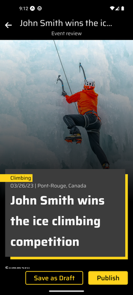
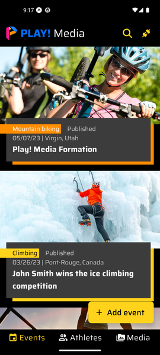
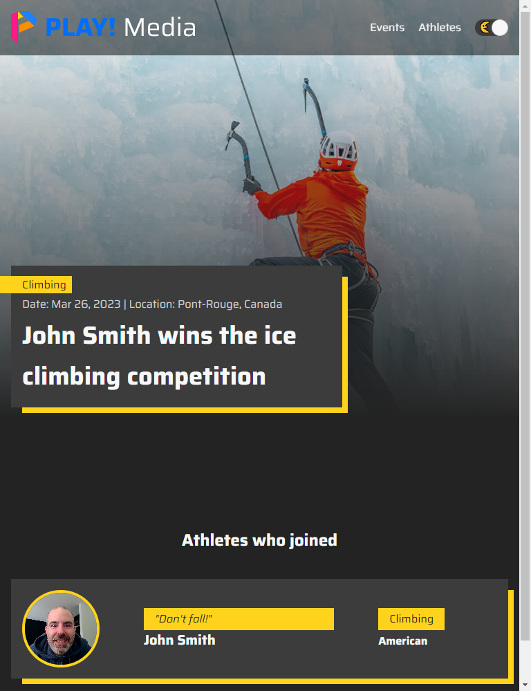

# Publish Multiple Content and Media at Once

## Adding a New Athlete

Follow the [Create Draft Content](../03.%20Create%20Draft%20Content/index.html) scenario.

Ensure you are saving the new athlete as draft, and you do not publish at the end.

## Adding a New Event

1. Go to the events listing screen.

1. Click on the "Add event" button.
1. Enter a title for the new event.

1. Next to the "Sport" field title, click the "Add" button.

1. In the "Select a sport" screen, select the desired sport.

1. Click the "Add Details" button.

1. Optionally add additional details about the new event.

1. Next to the "Athletes" field title, click the "Add" button.

1. In the "Add athletes" screen, scroll down to find the draft athlete created earlier.

1. Select that athlete.
1. Click the "Add" button.

1. Click the "Preview" button.

1. Review the new event detail page.

1. Click the "Publish" button.
2. Wait for the new media items, and new event to be uploaded to Content Hub ONE as draft, then for the draft media items, draft athlete, and draft event to be published.
3. Go to the [Finding the New Event and Media Items](#finding-the-new-event-and-media-items) section.

## Finding the New Event and Media Items

1. Scroll the events list and find your new event.

1. Go to the Media listing screen.

1. Refresh the media list by pulling down the image list.

1. Scroll the media list and find your new media items.

## Viewing the new Event, Athlete, and Media Items on the Published Web Channel

1. Open your demo instance PLAY! Media website.
2. Refresh the events page a few times until your new event is displayed.

    > **Note:** You must refresh the page once for Next.js incremental static revalidation (ISR) to regenerate the static events page and store the new version in Vercel's CDN in the background. Then you must refresh at least once more to get the new static page from the Vercel CDN.

    

3. Click on your new event to view its detail page.

4. Click on your new athlete to view its detail page.

