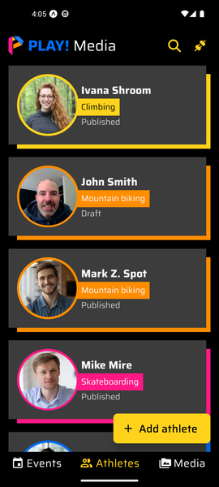
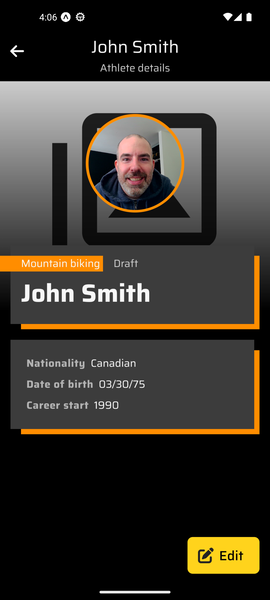
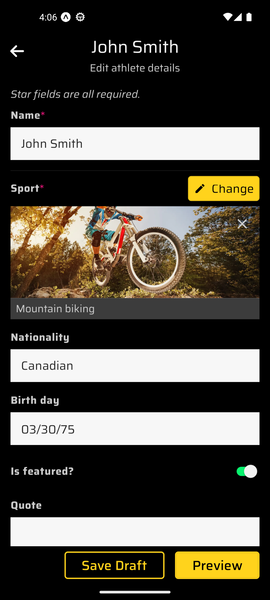
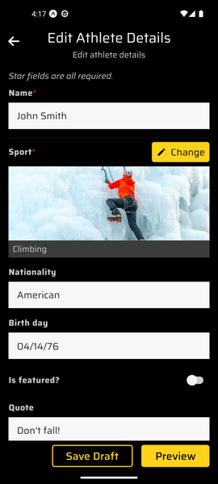
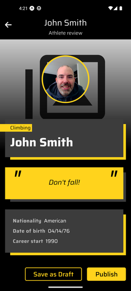
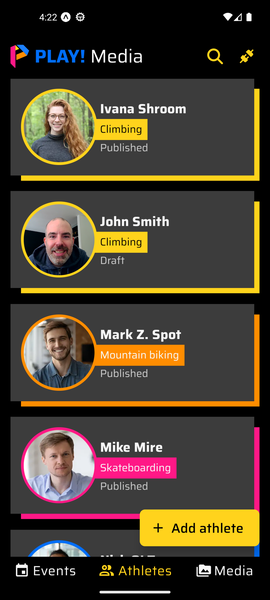

# Edit Content

## Editing an Athlete

1. Open the PLAY! Media mobile application.

1. Go to the athletes listing screen.

1. Click on an athlete.
1. Click the "Edit" button.

1. Edit the athlete details.

1. If you wish, you can stop the scenario at this moment by clicking the "Save Draft" button.

    1. Wait for the new media items and edited athlete to be uploaded to Content Hub ONE as draft.
    1. Go to the [Finding the Edited Athlete](#finding-the-edited-athlete) section.
1. Otherwise, you can continue by clicking the "Preview" button.
1. Review the edited athlete detail page.

1. Click the "Save as Draft" button.
1. Wait for the new media items and new athlete to be uploaded to Content Hub ONE as draft.
1. Go to the [Finding the Edited Athlete](#finding-the-edited-athlete) section.

## Finding the Edited Athlete

1. Scroll the athletes list and find your edited athlete.

