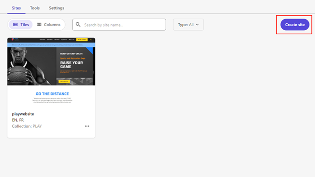
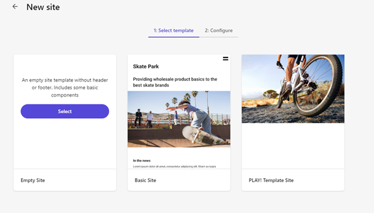
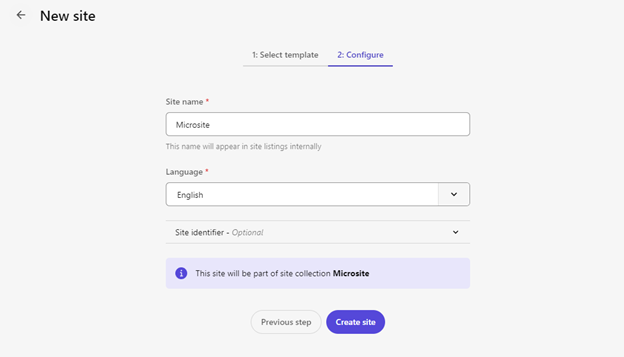
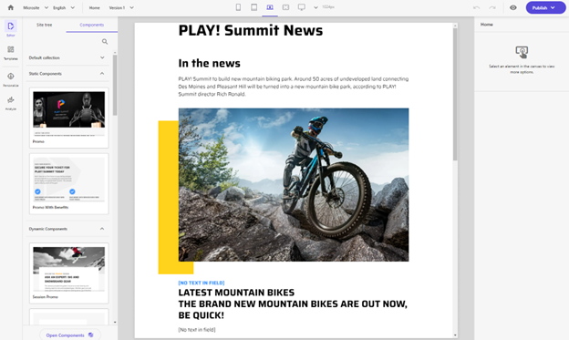

# Create New Site

1. The "XM Cloud Plus PLAY! Summit" demo includes a sample microsite template. Go to the Sitecore Launchpad / Sites UI and click "Create site".

1. You will see additional microsite template called **"PLAY! Template Site"**.

1. Fill in the required fields and click "Create site".

1. Wait until the site is deployed and go to the Pages UI. The sample microsite consists of just one page, but you can add additional pages as well as use any existing components from the main demo site.

