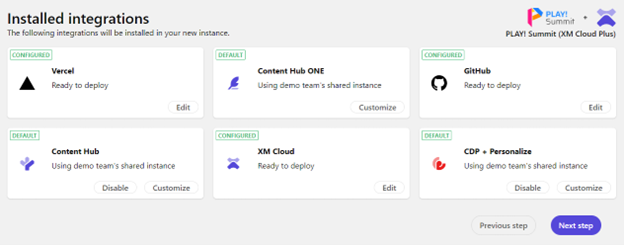
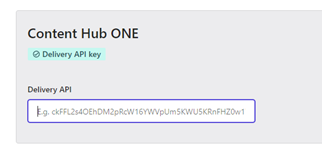
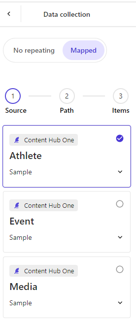
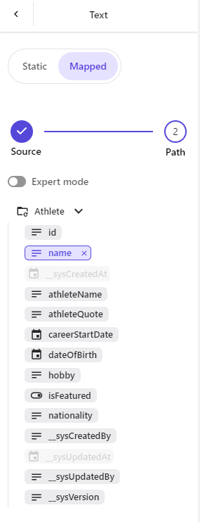
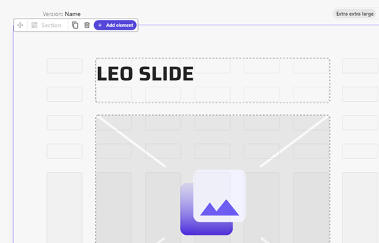
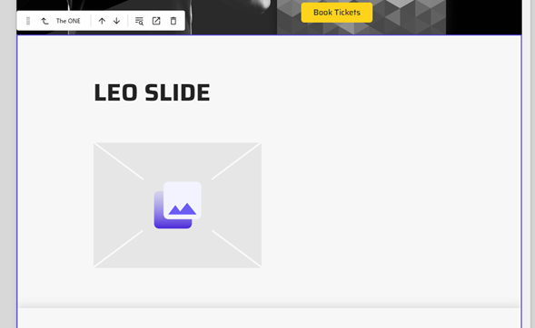
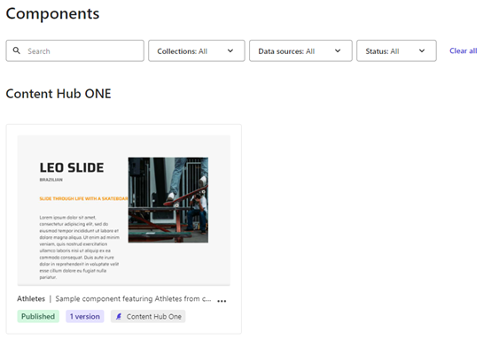
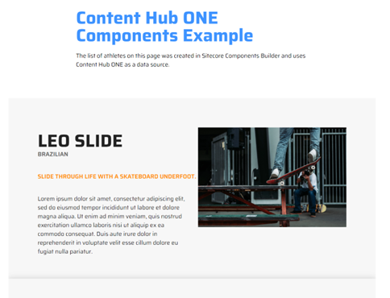

# Content Hub ONE Integration

The "PLAY! Summit XM Cloud Plus" demo includes an example integration with Content Hub ONE. When deploying the demo using the Demo Portal, you can provide your own Content Hub ONE instance details or use the Demo Team's default instance without any configuration needed.

- The Demo Team's default is a read-only Content Hub ONE instance with sample content.
- If you provide your own Content Hub ONE instance (existing instance) – it will be automatically populated with sample content and media.

1. If you are deploying the **"PLAY! Summit (XM Cloud Plus - Shared Organization)"** demo type, Sitecore Components will be automatically wired up to the Content Hub ONE instance (default or your own) and you will be able to use Content Hub ONE data in the Sitecore Components.

1. Alternatively, you can enable the integration manually by setting a Content Hub ONE Delivery API key on the Components setting page.

1. When creating a new component in Sitecore Components, you will see new content types in the "Data collection" (all content types from the attached Content Hub ONE instance).

1. After picking a content type, you can setup mappings between the content and the component fields.

1. Once configured and published, the component will be usable in Sitecore Pages.

1. There is also a sample component already connected to a Content Hub ONE data source. It is added to a landing page available on the front-end of the website [(/landing-pages/landing-page-ch-one-content)](https://{{demoName}}-{{demoUid}}-website.vercel.app/landing-pages/landing-page-ch-one-content).

