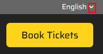
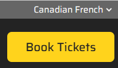
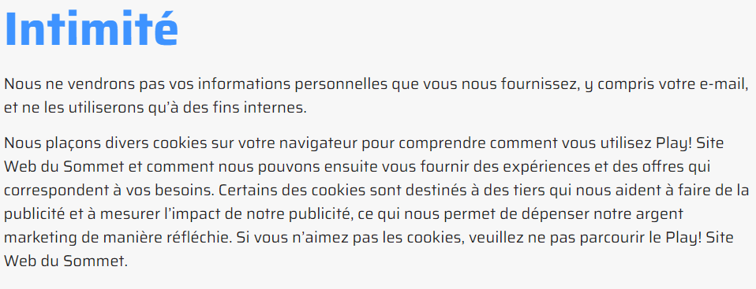
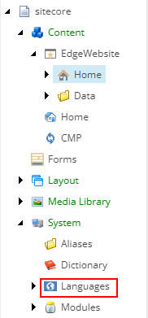
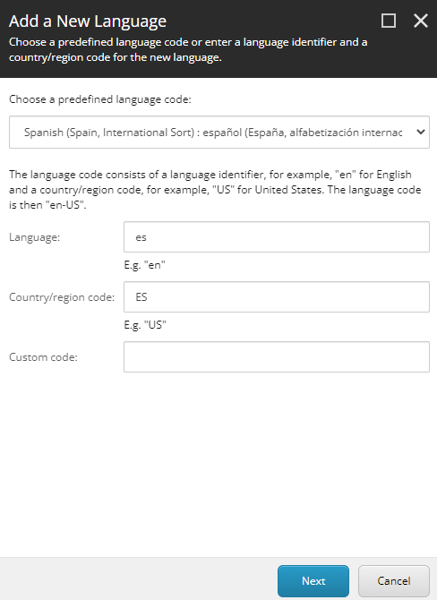
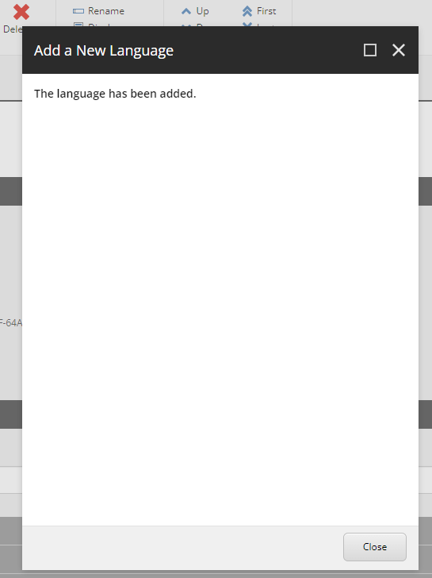
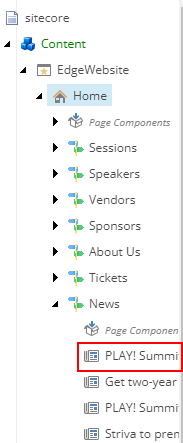
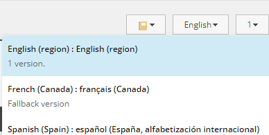
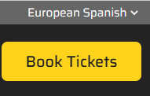
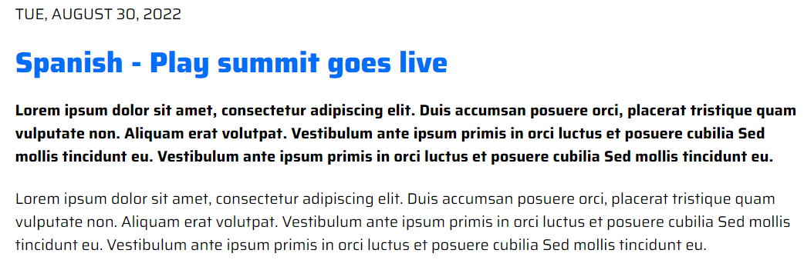

# Content Localization

## Part 1. Introduction

1. Go to the [PLAY! Summit Website](https://{{demoName}}-{{demoUid}}-website.vercel.app) and you will see a language picker it the right top corner of the page.

1. Navigate to the footer of the page and click "Privacy policy" section.

1. You will see the English version by default. Switch the language into Canadian French by clicking the language picker in the right top corner of the page.

1. You will see the Canadian French version of "Privacy Policy" section.

## Part 2. Add your own language

1. Log in to Sitecore Launchpad.

1. Go to Content Editor application.

1. Expand the "System" item in a Content Tree, click on "Languages"
    item.

1. Add a new language by clicking the "Language" button.

1. Choose a language in "Add a New Language" pop-up window and click the "Next" button a few times.

1. You will see a pop-up window, that notifies you about added
    language, click the "Close" button.

1. The new language item will appear under the /sitecore/system/languages item.

1. Click the newly created item, go to the "Fallback Language" field, and choose English.

1. Click "Save" button in the left top corner of Content Editor.

1. Return to the Sitecore Content Tree, expand the "Home" item, expand the "News" item, and click on "PLAY! Summit Goes Live".

1. Choose your language in a language picker in the right top corner of the page.

1. You will see a notification that the current item does not have a version in your language

1. Click "Add a new version" link.

1. Fill in the Page Title, Title, Excerpt, Content, Image fields and choose "Today" option in Publish Date field.

1. Click the "Save" button in the left top corner of Content Editor.

1. Go to the "Review" tab.

1. Click the "Submit" button.

1. Skip ahead the "Enter a comment" pop-up window by clicking "OK" button.

1. Click the "Approve" button.

1. Skip ahead the "Enter a comment" pop-up window by clicking "OK" button.

1. Return to the [PLAY! Summit Website](https://{{demoName}}-{{demoUid}}-website.vercel.app), choose the "News" section in the footer of the page, click on "PLAY! Summit Goes Live".

1. Choose your language in a language picker in the right top corner of the page.

1. You will see the updated version of your content in your language.

## This scenario shows that you can translate your content into any language and publish it easily
