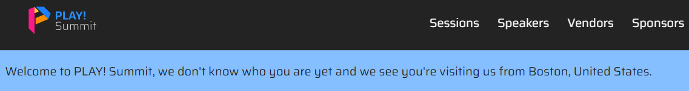
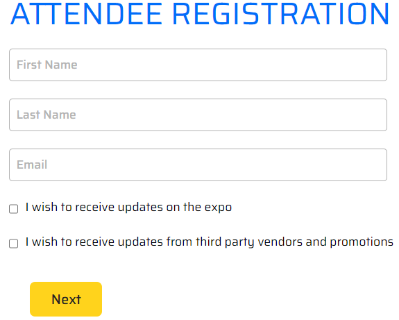
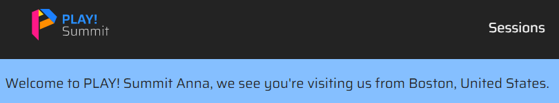
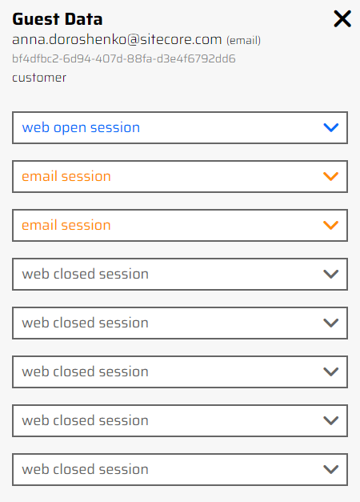

# Dynamic welcome message

1. Open the [PLAY! Summit Website](https://{{demoName}}-{{demoUid}}-website.vercel.app) in a new browsing session.

1. You see the message "Welcome to PLAY! Summit, we do not know who you are yet, and we see you are visiting us from..." (depends on Geolocation API).

1. Click a button "Book Tickets".

1. Choose the desired ticket and you will see a registration form.

1. Fill out this form and return to the home page of the website.

1. You have been identified and you will see your name in the header.
    

    After you submitted personal information, you can also see your email address and activities in the Guest Data sidebar on the right.
    

> This allows to highlight that we are capturing visitor information and can reuse it within a session
