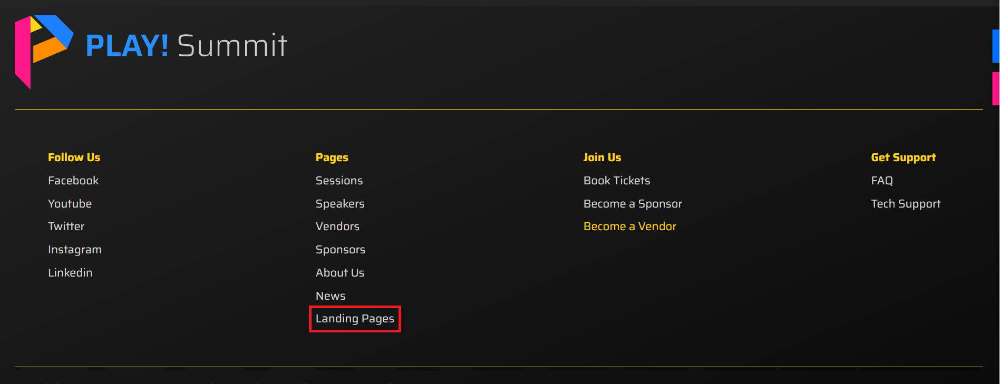
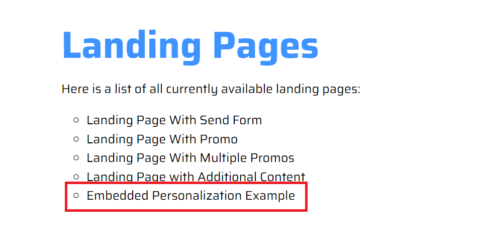
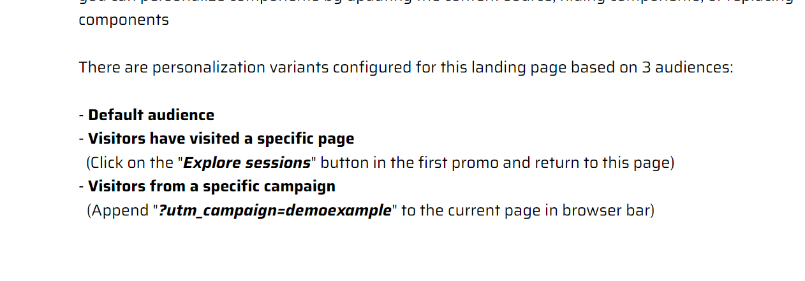
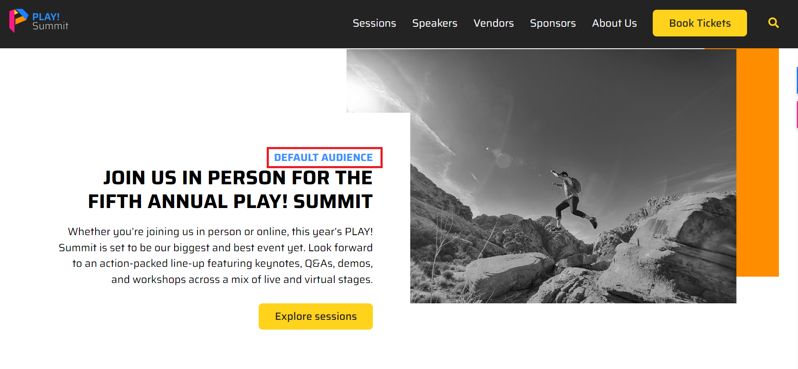
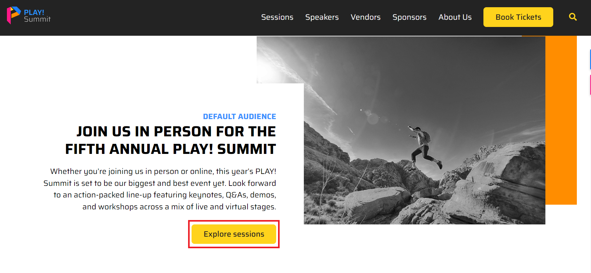
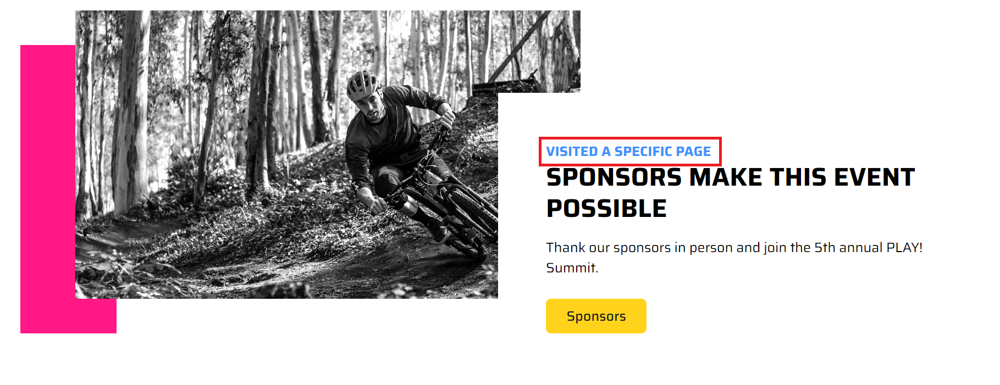
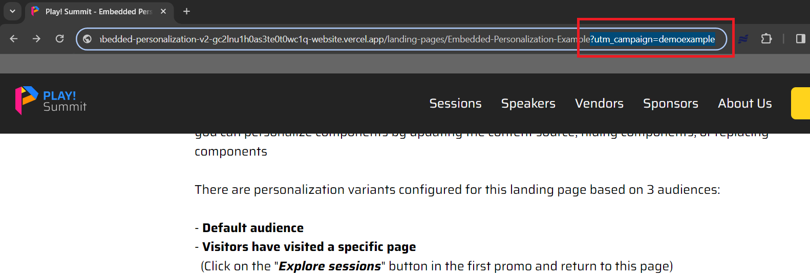

# Embedded Personalization Example

1. Go to the [PLAY! Summit Website](https://{{demoName}}-{{demoUid}}-website.vercel.app) and navigate and click on the "Landing Pages" link in the footer to see the list of available landing pages.

    

1. Click on the "Embedded Personalization Example" landing page.

    

1. Review the instructions on the landing page that describe how to trigger the 3 different personalization variants of the page.

    

1. The content is displayed for the default audience when navigating to the page as a new visitor (ie: Incognito mode)

    

1. Next, click on the "Explore sessions" button to view the /sessions page and trigger a different personalization variant.

    

1. Navigate back to the landing page to see content displayed for the personalization variant (Refresh the webpage if you hit the browser back button).

    

1. Next, copy the UTM campaign example from the on-page instructions and append "?utm_campaign=demoexample" to the page URL in the browser bar.

    

1. Scroll down to see content for the personalization variant.

    

> This scenario is an easy way to show off Embedded Personalization within Pages and on the front-end of a website.
