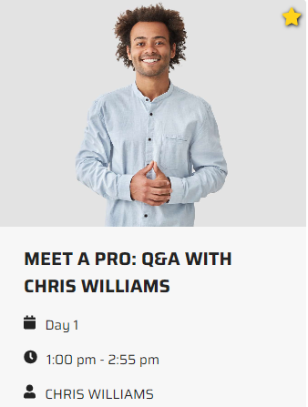

# Ticket checkout vip upsell

1. Open the PLAY! Summit website in a new browsing session. 

2. Click a button "Book Tickets".

3. Choose a "Regular Ticket" and confirm your purchase.

> 

4. You will be redirected to the confirmation page.

5. Go to the Sessions page and visit one of the Premium Sessions
    (marked with a star icon).

> 

6. You'll get a pop-up window, encouraging you to purchase a VIP
    ticket:

This demonstrates that all actions performed by the visitor are tracked
and can be used for upselling or other purposes within the current
session.
