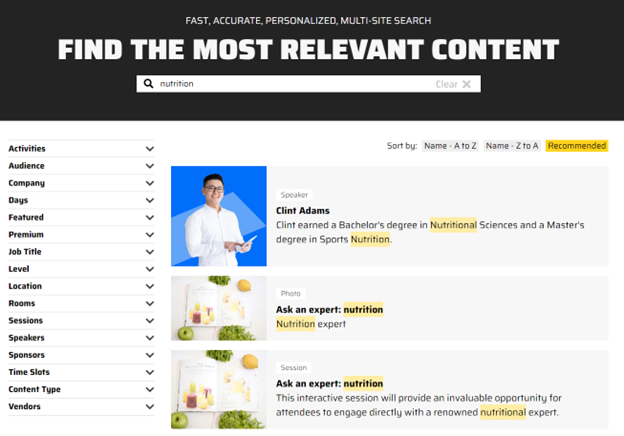
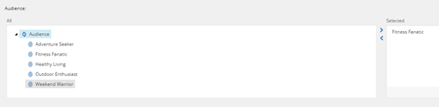
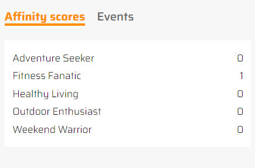
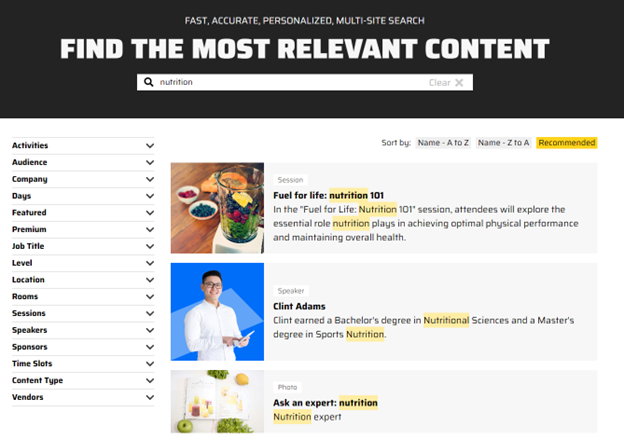
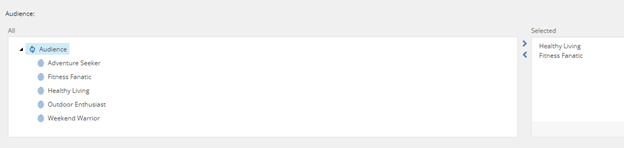

# Personalized Search

Sitecore Search is configured to return personalized content based on user behavior.

1. To demonstrate how it works, first go to the Home page of the website and search for **"nutrition"**. You will be presented with results from different sections of the website containing this search term.

1. Next, let’s do the same search but first go to the "Sessions" page in the top menu and click on the last session from the list: **"TRAIN SMARTER NOT HARDER"**.

1. This session page is tagged with "Fitness Fanatic" audience in Sitecore.

1. If you go back to the home page and explore the visitor's search profile (using the sidebar tab on the right), it will show the visitor has been automatically placed in the "Fitness Fanatics" audience.

1. Sitecore Search can use cutomer data, like audience, to display more personalized search results. Perform a search with the **"nutrition"** keyword again.

1. The top result is different! The piece of content contains the "nutrition" keyword and is also tagged as "Fitness Fanatic" audience in Sitecore.

1. Sitecore Search is able to use customer data to adjust search results and optimize the customer experience.
