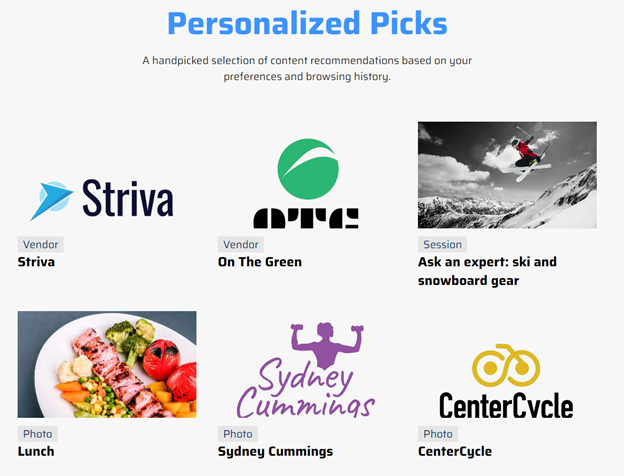
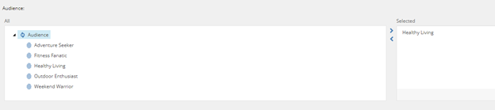
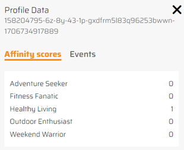
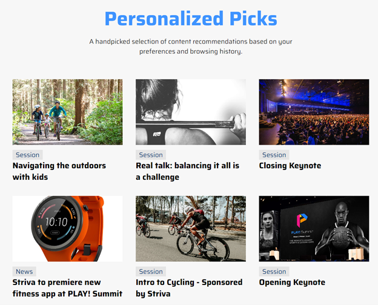

# Content Discovery

Sitecore Search can surface personalized content based on customer behavior.

The **"Personalized Picks"** component is a Sitecore Search widget that returns personalized content based on the customers page views, search history and more.

1. To demonstrate how it works, first go to the Home page of the website. The **"Personalized Picks"** component will display default content from the different sections of the website.

1. Next, go to the "Sessions" page in the top menu and click on the session named **"ASK AN EXPERT: NUTRITION"**.

1. This session is tagged as "Healthy Living" audience in Sitecore.

1. If you go back to the home page and explore the customer's search profile (using the sidebar tab on the right), it will display the visitor has been segmented in the "Healthy Living" audience.

1. Sitecore Search is now surfacing personalized content recommendations in the **"Personalized Picks"** component.

