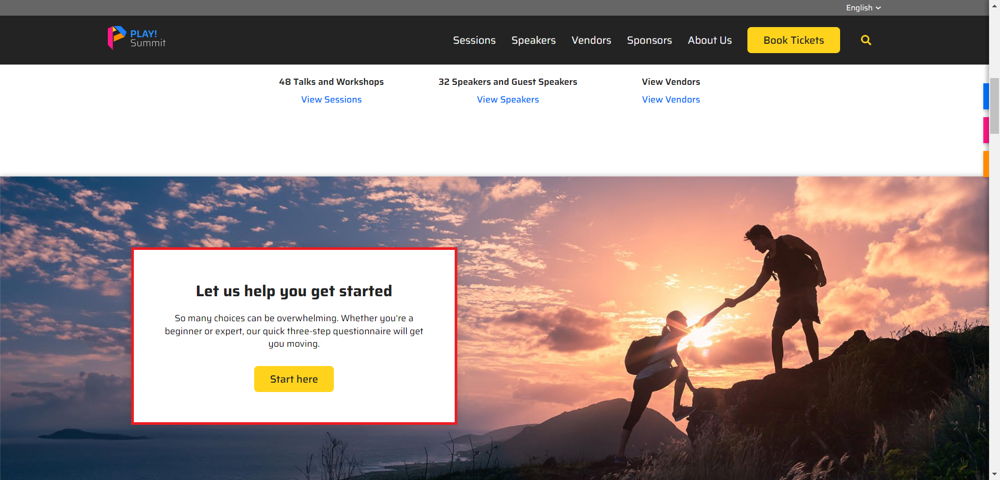
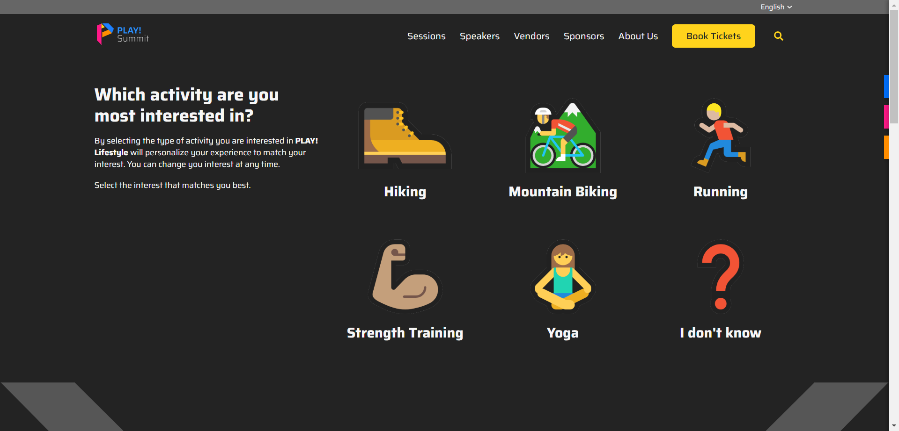
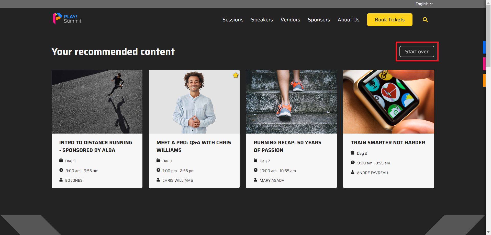

# Session Finder Questionnaire

This questionnaire is an example of collecting first party data from a user to personalize the experience.

1. Go to the [home page](https://{{demoName}}-{{demoUid}}-website.vercel.app) of the website and click on the **"Start here"** button in the "Let us help you get started" promo.

    

1. A simple 3 step questionnaire will be presented - click on a icon/text option for each step.

    

1. Relevent event sessions will be surfaced to the user based on their questionnaire answers. You can restart the questionnaire at any time by clicking on the "Start over" button above the recommended content.

    
