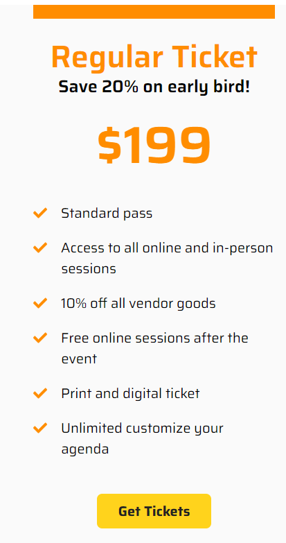
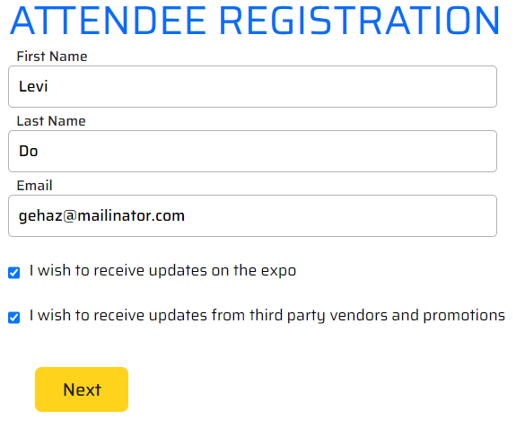
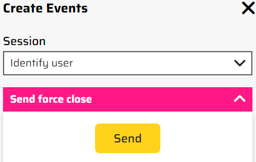
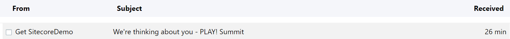
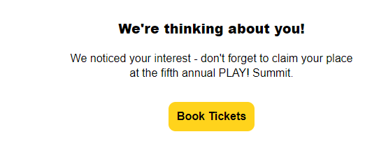
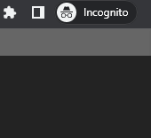
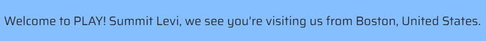

# Email link via incognito mode

1. Open the PLAY! Summit website in a new browsing session. 

2. Click the "Book Tickets" button in the right-hand corner of the
    page.

> 

3. Click the "Regular Ticket".

> 

4. Click the "Get Tickets" button.

5. Fill out the Attendee Registration form.

> 

6. Click the "Next" button.

7. Click the pink button in the side bar on the right of the screen.

> 

8. Choose "Send force close".

> 

9. Click the "Send" button.

10. Open your mailbox.

11. Find an email from PLAY! Summit website, encouraging you to complete
    your purchase.

> 

12. Open this email and you will see the yellow button.

> 

13. Open the "Book Tickets" link in incognito window.

> 

14.  You will see your name above the hero banner at the home page.

> 
>
> This demonstrates that you can be identified on any device, i.e., your
> mobile phone or your work laptop when you follow a link from the email
> message.
