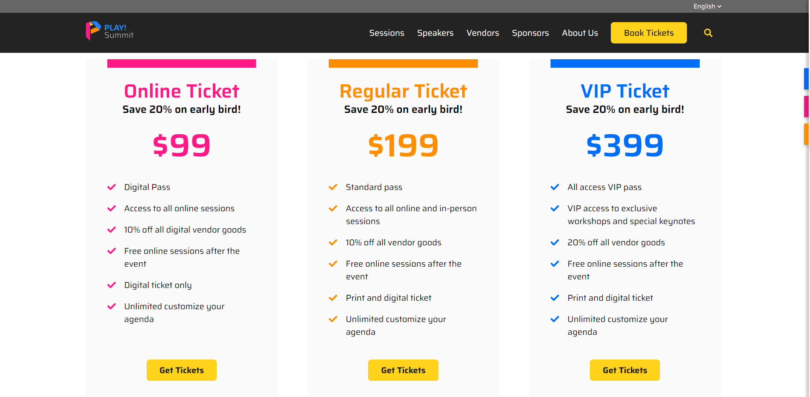

# Call Center App Example

The purpose of this example is to show how customer data can be used in 3rd party applications to surface "Next Best Actions" to business users. When a business user triggers the "Next Best Actions", the customer experience can be updated in real-time.

1. Open the [PLAY! Summit Website](https://{{demoName}}-{{demoUid}}-website.vercel.app) in a new browsing session.

1. Click the "Book Tickets" button in the right-hand corner of the
page.

    

1. Click the "Get Tickets" button for the **"Online Ticket"** option.

    

1. Fill out the Attendee Registration form and click the "Next" button. **Important! Stop here after submitting the form - do not complete the ticket purchase yet!**

    

1. Click the "Demo Pages" link in the footer of the page.

    

1. Click the "CareConnect" link.

    

1. Find the user you just created when filling out the registration form. The right hand side of the Call Center App will show the user has an "Abandoned purchase". The "Next Best Action" is presented to the business user in the blue box.

    

1. Click the "Apply offer" button.

1. Return to the [home page](https://{{demoName}}-{{demoUid}}-website.vercel.app) of the website. (Refresh the page if you already have the home page open). A popup has been triggered for the user based on the "Next Best Action" applied by the business user.

    

1. Click on the button in the popup to go to the tickets page. A discount has been applied to the "Online Ticket" price.

    

1. Click on the "Get Tickets" button for the **Online Ticket** and complete the purchase. **Tip: You do not need to fill out any fields on the Payment Infromation page. You can leave it all blank for demo purposes and click the "Confirm Purchase" button.**

    

1. Navigate back to the Call Center App. After purchasing an Online Ticket, the "Next Best Action" has been updated. If a customer already has an Online ticket, the business user can choose to upsell them and apply a discount to the "Regular Ticket" price.

    

1. Click the "Apply offer" button to apply the next discount.

1. Return to the [home page](https://{{demoName}}-{{demoUid}}-website.vercel.app) of the website to view the new discount.

    

    

1. You can stop here or continue this process until the customer has purchased a VIP ticket.
