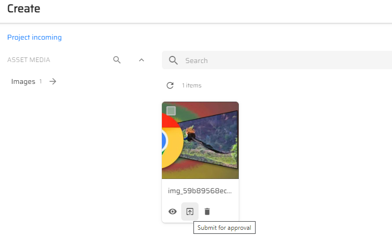
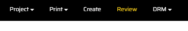
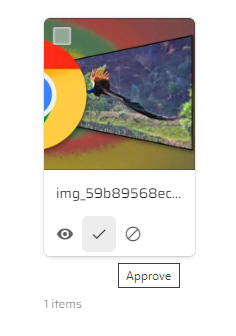

# Creating DAM Assets in Content Hub

1. Go to your Content Hub instance.

1. Click on "Create" on the top menu.

1. Upload a media file.

1. Once uploaded you will see the thumbnail generate and the media is ready to be submitted for approval.

1. Once approved click on "Review" on the top menu.

1. "Approve" or "Reject" the asset.

1. If approved the asset will then show up on the "Asset" page from the top menu. If the asset is rejected it will go back to the "Create" page.

1. This asset is now ready to be used with DAM.

>This scenario shows how to create an asset to be used with Sitecore DAM.
