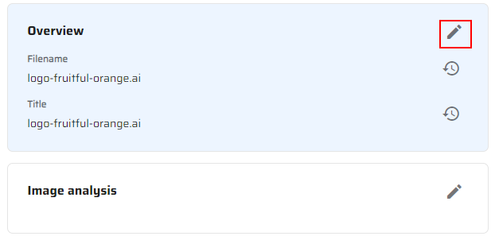
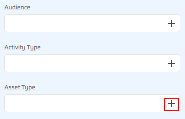

# Image analysis

The image analysis feature generates tags relevant to the content of images like people, animals, objects, scenery, or actions.

This feature relies on Azure Cognitive Services, a tool for image recognition. Sitecore DAMTM integrates it to generate asset auto-tags, descriptions and color recognition data (on images and vectors only).

If you need to set up image analysis:

1. Go to your Content Hub instance.

2. Click the "Create" link.

> 

3. You will see the asset there by default, click on it.
> 

4. Open the "Overview" section and click the "Edit" button.
> 

5. Click the "Add" button near the "Asset Type" field.
> 

6. Set "Sponsor" in the "Asset Type" pop-up window and click the "OK" button.
> 

7. Click the "Save" button in the "Overview" section and refresh the page a few times.
> 

8. You will see the added tags and recognized colors in the "Image analysis" section.
> 

This scenario shows how your assets can be auto-tagged with your metadata through artificial intelligence in Content Hub product.
