# Digital Rights Management functionality in Content Hub


We will write this **first version**

_Second version_


1. Go to your Content Hub instance.
2. Click the "Assets" tab.
> 

3. Expand the "Usage rights" tile.
> 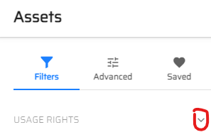

4. Choose the period of time, which you need to use these assets, by filling out the Start and End dates.
> 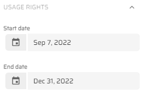

5. Click the "Add" button under the "Territories" tile and you will see the "Territories" pop-up window.
> 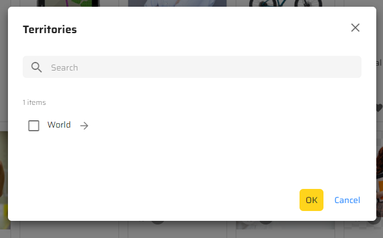

6. Set the "World" checkbox and click the "OK" button.
> 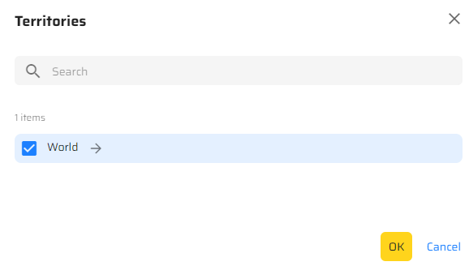
7. Click the "Add" button in the "Media" tile and you will see the "Media" pop-up window.
> 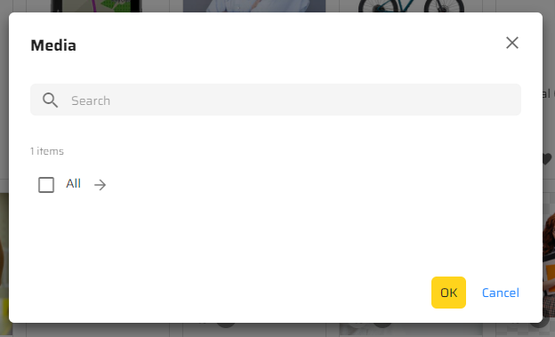

8. Click the "Arrow" button near "All" item, set "All/Traditional" checkbox and click the "OK" button.
> 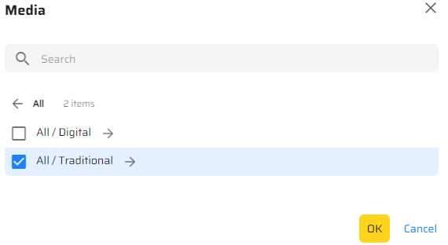

9. Click the "Apply" button under the "Media" tile.
> 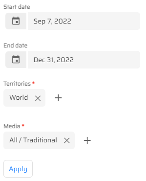
    
10. You will see 435 items which meet the set up criteria.
> 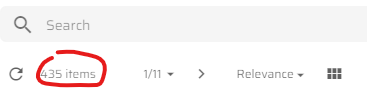
> 
11. Open the "DRM" tab and click the "DRM contracts" link.
> 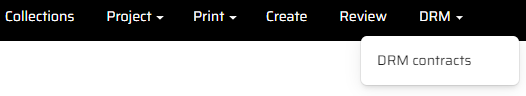

12. Click on "Striva brand assets" contract, go to the "Assets" tab and click the "Rights profiles" tab.
> 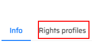

13. Choose "Striva brand rights" and click the "Assets" tab.
> 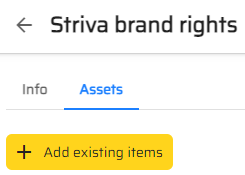

14. Click the "Add existing items" button and indicate "Striva" in the searchbox. You will see existing items.
> 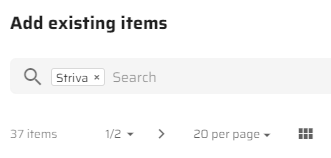

15. Choose a couple of items and click the "Add" button in the right-low corner of the window.
> 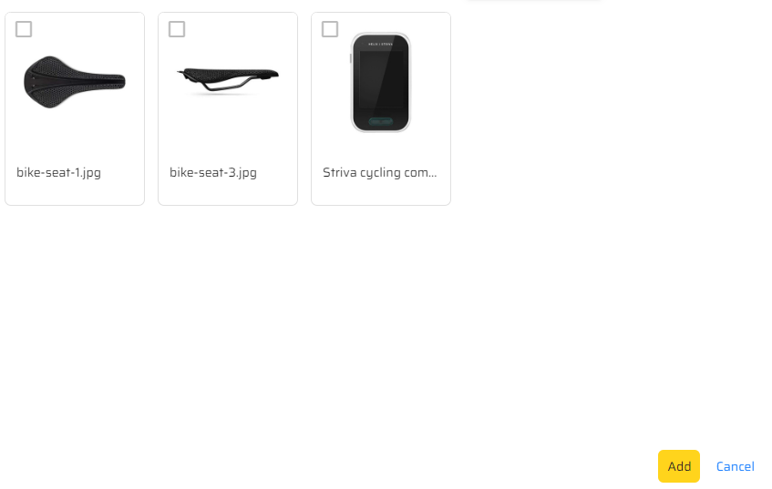

16. You will see your selected items.
> 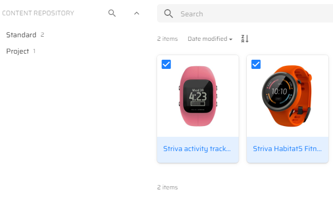

17. Return to the "Assets" tab, click again the "Usage rights" tile, fill in the same "Start date", "End date", "Territories" and "Media" tiles, click the "Apply" button.
> 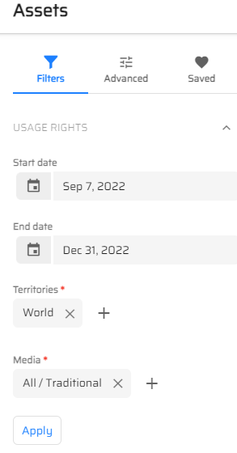

18. You will see the changed number of items.
> 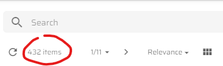

This scenario shows how to add assets to your DRM contract and how these assets can be applied depending on digital or traditional way of usage.

