# Publishing content and asset images from Content Hub to Sitecore XM.

1. Login to your Content Hub demo instance.

2. Click the "Content" item.

> 

3. Click the "Search" item.

> 

4. You will see the "News" item in the "Content Type" section in the
    left side pane, click on it.

> 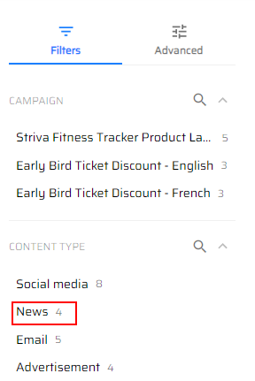
>
> We have 4 news articles, and we will create a new one.

5. Click on the "Add Content" button in the right top corner of the
    page.

> 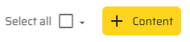

6. Fill in the "Name" field, add type "News" in the "Content" pop-up
    window.

> 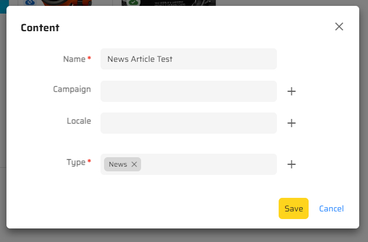

7. Click the "Save" button.

8. You will see a blank page, click the "Edit" button.

> 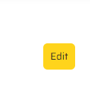

9. Fill in the Title, Excerpt, Content fields.

> 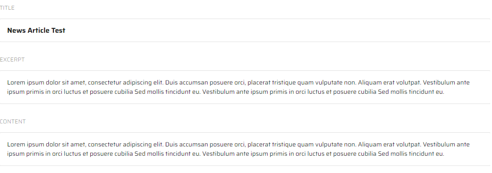

10. Click the "Save" button.

> 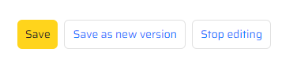

11. Add a new image by clicking the "Add" button under the "Content"
    field, choose "Add existing items" option.

> 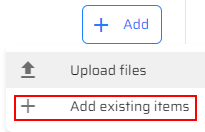

12. Choose an existing item.

> 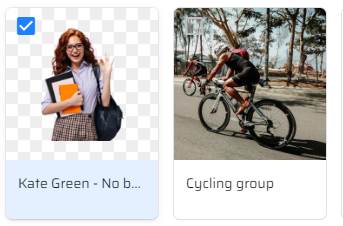

13.  Click the "Add" button at the bottom of "Add existing items" window.

> 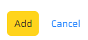

14. Click the "More actions" button to set this image as cover one in
    case you have a couple of images.

> 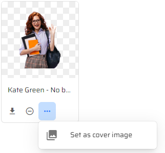

15.  Click "OK" button in "Set as cover image" pop-up window.

> 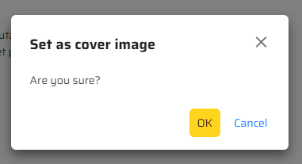

16.  Choose the "Details" tab on the right-hand side of page.

> 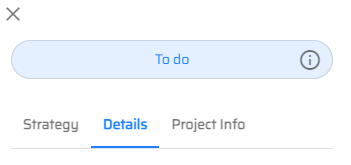

17. Click the Edit icon.

> 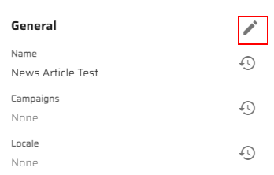

18. Choose the date you want your article to be published on by clicking
    the Calendar icon.

> 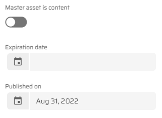

19. Click the "Save" button under the "Project Info" tab.

> 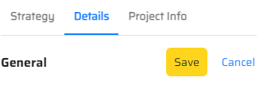

20. Click the "Start" button in the right top corner of the page to
    publish it.

> 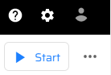

21. Click the "Send for review" button in the right top corner of the
    page.

> 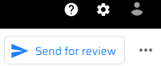

22.  Click the "Approve" button in the right top corner of the page.

> 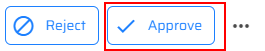

23. Click the "Confirm" button in "Approve" pop-up window.

> 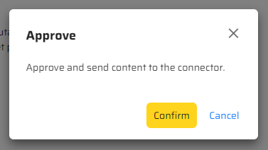

24. Go to Sitecore Launchpad.

25.  Open the following item in a Content Editor:
    **/sitecore/content/EdgeWebsite/home/news**, you will see a new
    article.

> 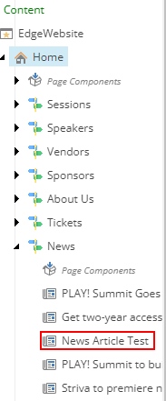
>
> This scenario shows that you can publish content from Content Hub to
> Sitecore XM.
