1. Log in to your Content Hub instance.

2. Click the Content link.

> 

3. Click the drop-down menu and choose "Search" link.

> 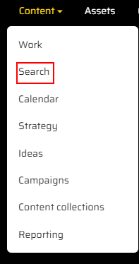

4. Click the "News" link in the left-side panel.

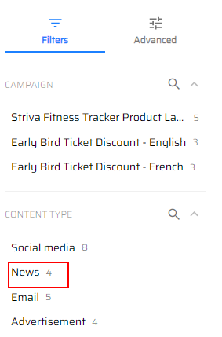

5. You will see 4 news articles.

> 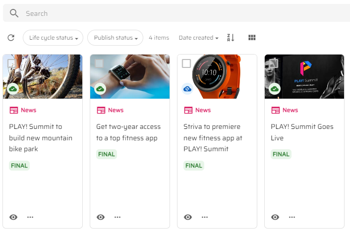

6. Click on one, for instance "PLAY! Summit to build new mountain bike
    park".

> 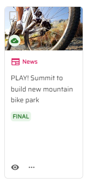

7. You need to indicate the language of existing content and mark it as
    "English" in "Locale" window in the right-side bar by clicking the
    Edit button.

> 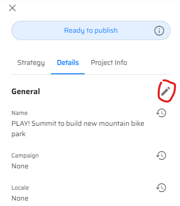

8. Click the "Add" button near the "Locale" row.

> 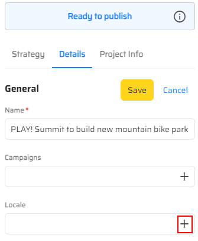

9. Choose the "English" item in the list of languages.

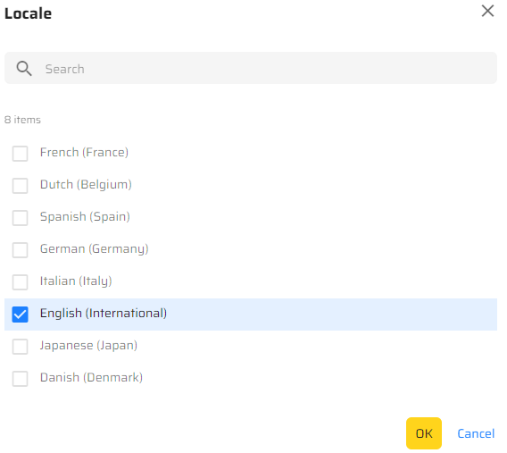

10.  Click the "OK" button and then click the "Save" button.

> 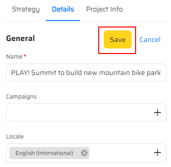

11. You will see the selected language in the right-side bar.

> 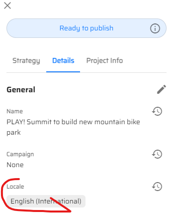

12. To translate your content, click the "More actions" button in the
    right top corner of the page.

> 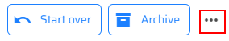

13. Click the "Localize" link in the drop-down menu.

> 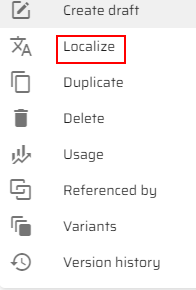

14. You will see a "Localize" pop-up window, where you should fill in
    "Name" and "Locale" fields.

> 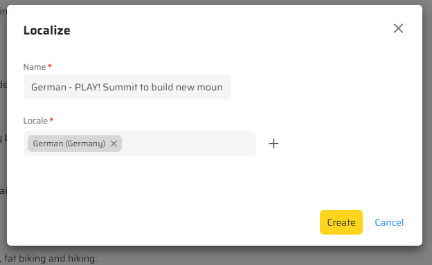

15. Click the "Create" button.

> 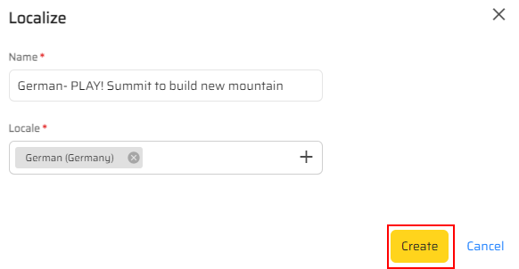

16. You will see the updated content in your news article.

> 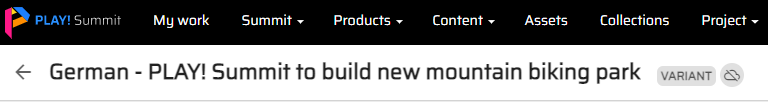

17. To push your content to Sitecore XM, click the "Submit" button in
    the right top corner of the page.

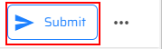

18. Click the "Approve" button.

> 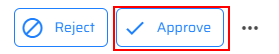

19. Click the "Start" button.

> 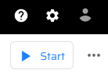

20. Click the "Send for review" button.

> 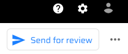

21. Click the "Approve" button and you will see the "Approve" pop-up
    window.

> 

22. Click the "Confirm" button to approve and send content to the
    connector.

23. Go to the Launchpad Sitecore.

24. Click the Content Editor tile.

> 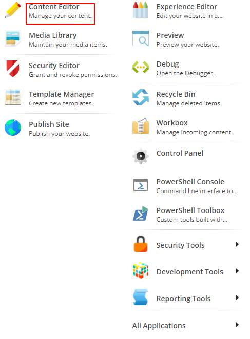

25. Go to "Home" and then, to the "News" sections in the left-side bar.

> 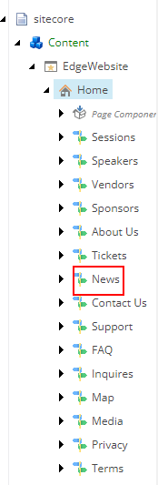

26. Find the "PLAY! Summit to build new mountain bike park" article in
    the drop-down menu.

> 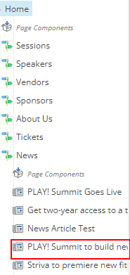

27. Click the "German" in the right-top corner of the "Content" window
    to see the translated version of your article.

> 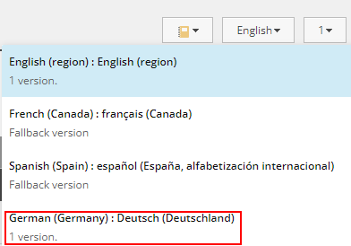

28. You will see the updated content in Sitecore XM as well.

> 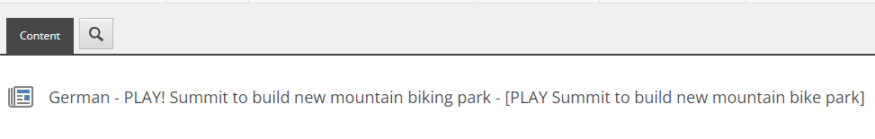
>
> This scenario shows how you can easily translate your content and
> publish it in Sitecore XM.
