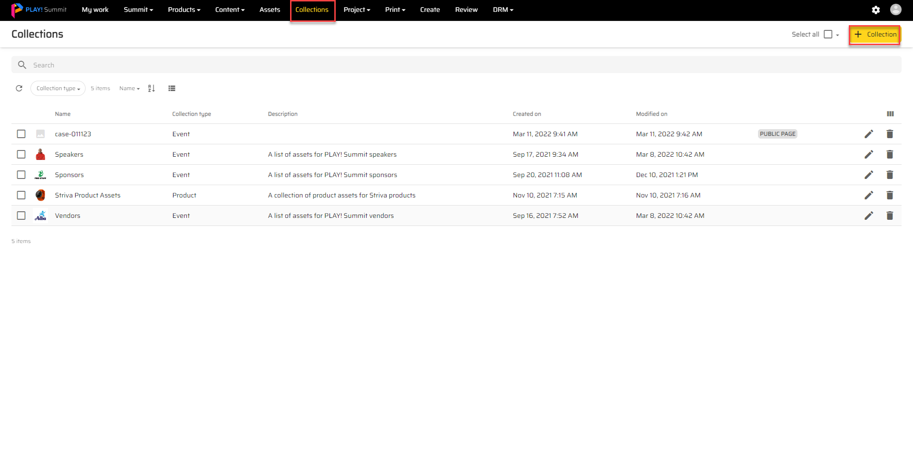
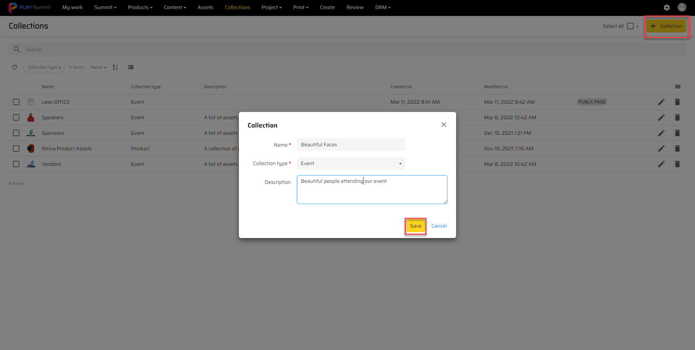
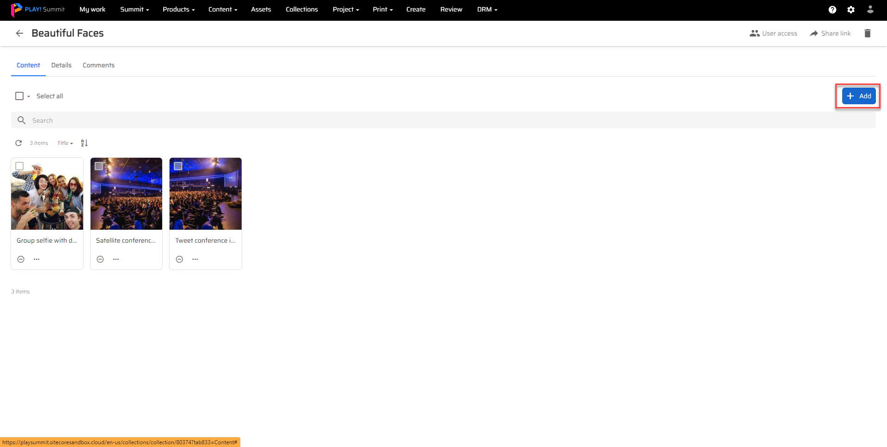
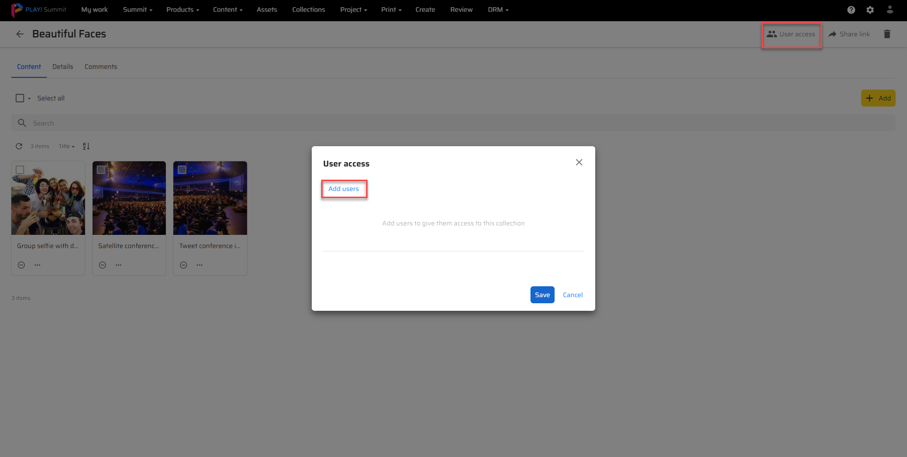
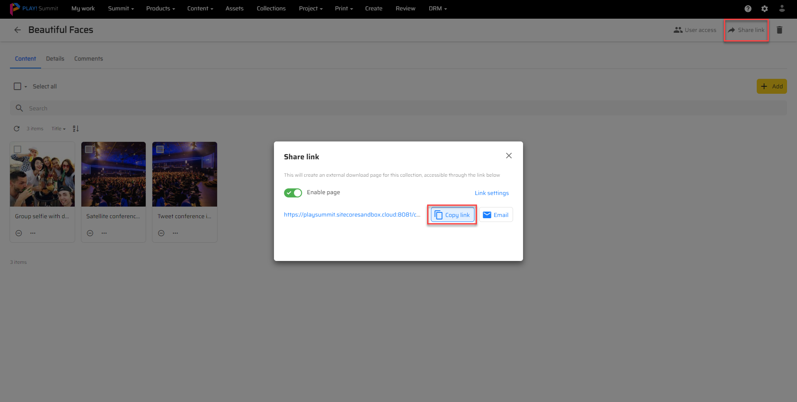

# Use collections to group and share groups of assets​

This scenario describes how a user can create collections to group and share assets using Content Hub DAM to speed-up projects​ and control access for third parties.

1. Go to your Content Hub instance.

1. Click the "Collections" menu item from the top navigation.

1. Click on "add" and create a new collection for the assets you would like to use.
1. Use a proper name, description and type for the collection so it's easier for contributors to distinguish.

1. Once created, click on the "add" button to add assets to the collection.
1. There are two ways to add assets to a collection. You can either paste images that have been copied from any source or add already uploaded assets from this instance.

1. When the collection is ready for collaboration there are two ways to share it with other users. You can give access to other users in your instance.

1. To give access to external users, use the "Share Link" button on the top right.

1. Users with access will be able to download, comment and make changes to the assets that are included in the collection.
