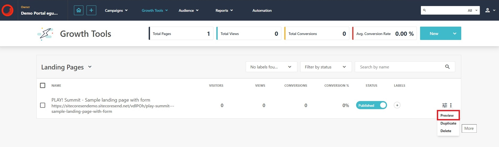
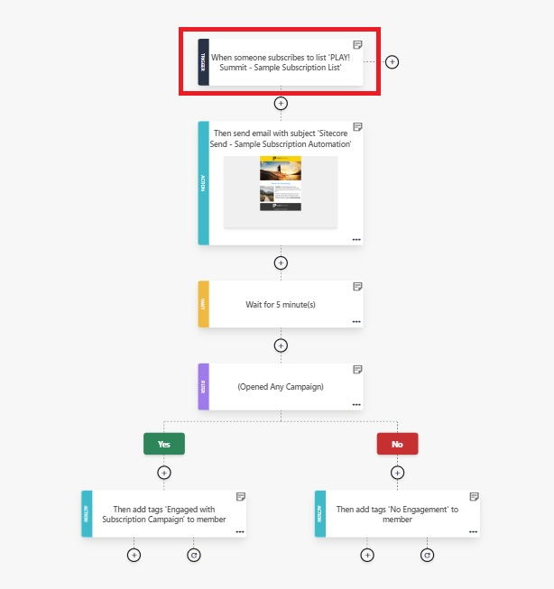
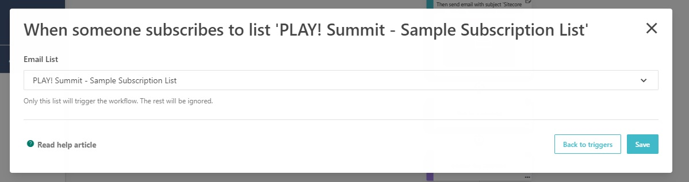
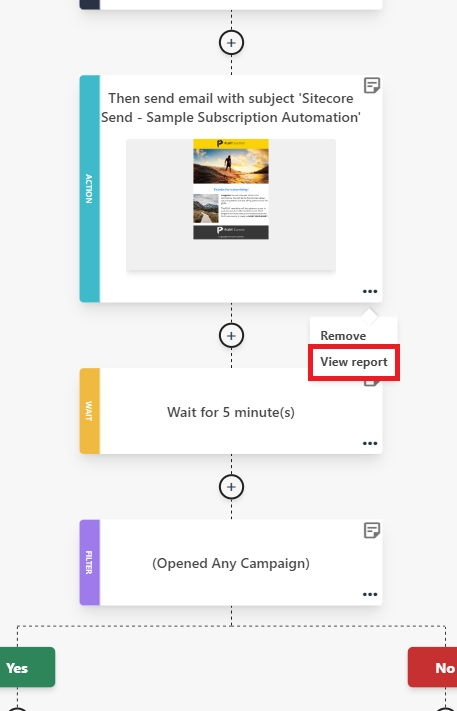

# Using Automation Workflows

To see examples of Automation, you can review the pre-configured Automation Workflows or easily create a new Automation from an existing **"recipe"**. This scenario will demonstrate the process of collecting a marketing lead via a form submission and how to trigger an Automation based on that form submission.

## Submit a Marketing Form

1. Go to the landing pages listing (<https://sitecoresendemo.sitecoresend.io/lead-generation/landing-pages/list/1>) and click on the vertical ellipsis beside the landing page named **"PLAY! Summit - Sample landing page with form"**. Click on it.
   

1. Complete and submit the lead generation form on the landing page. For the purpose of this scenario, you should use a real email to receive an email from the Automation.

## Email List

1. After form submission, the contact will be added to the email list named **"PLAY! Summit - Sample Subscription List"**. Navigate to the email lists (/mailing-lists-new/list/mailing-lists/1) and select **"PLAY! Summit - Sample Subscription List"**. Click on the **"View all members"** option in the left-hand menu to view the contact you added.
   

## Automation

1. Go to the automations listing (<https://sitecoresendemo.sitecoresend.io/automations>) and click on the automation named **"PLAY! Summit - Sample Subscription Automation"**. Click on the **"Preview"** option.

1. Contacts are placed into the automation workflow based on the settings configured in the automation **"Trigger"**. Click on the **"Trigger"** box that appears at the top of the automation workflow.
   

1. The **"Trigger"** is configured to add a contact to the automation workflow whenever a new contact is added to the email list named **"PLAY! Summit - Sample Subscription List"**.
   

1. You should receive an email in your inbox with the email address used to submit the marketing form. If you do not see the email, check to see if the email was routed to spam or marketing inboxes.

1. You can review reports and statistics about the email campaign that is sent as part of the automation workflow.
   
