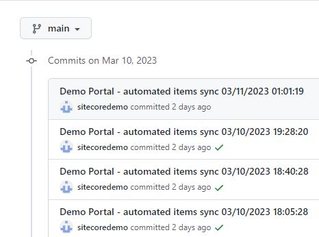
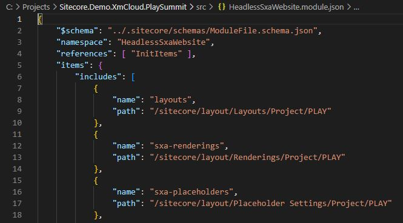
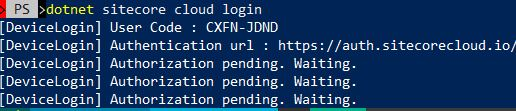
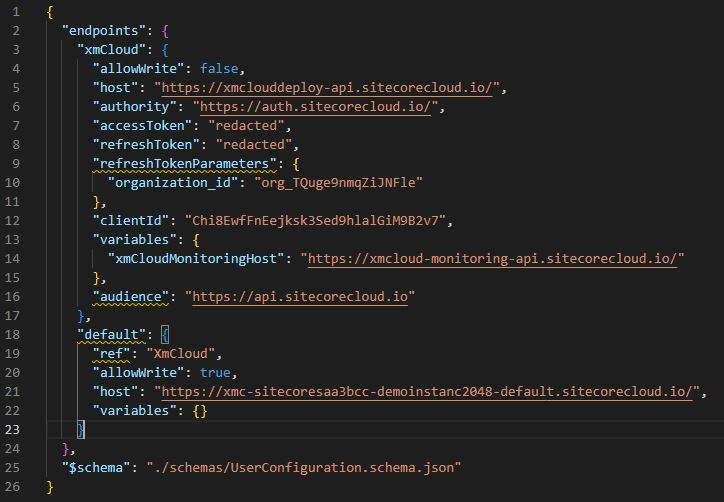
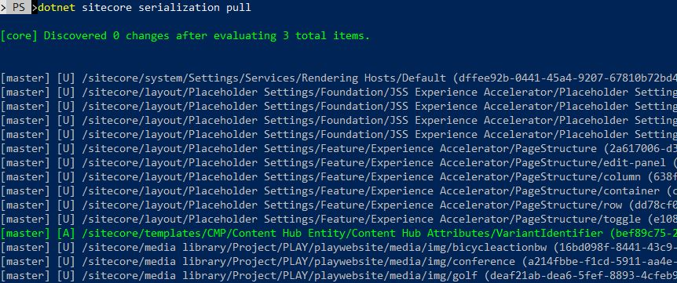

# Save item changes to Git

If you're deploying a demo into XM Cloud Shared organization, your instance will be shutdown automatically (deallocated). All modifications need to be saved to the Git repo attached to the instance.

## Automated item sync on instance shutdown

1. When the instance is stopped (manually or on schedule), all demo items (referenced in the `*.module.json` files located directly under the `src` folder) will be pulled from XM Cloud instance and pushed into your GitHub repository.

    

2. If you are making changes to the item paths that are not setup in PLAY! Summit repository, you might need to add them in the `*.module.json` files located directly under the `src` folder.

    

## Manual sync using Sitecore CLI

If you've made some content changes and want to immediately pull them into your own Git repository, you can use Sitecore CLI.

1. Clone the repo you want to sync the data to. This should be the same repo you've used for XM Cloud demo instance deployment.

2. Go to the project folder and type: `dotnet tool restore`, execute the command and then run `dotnet sitecore cloud login`
    

3. Login to the org where the project is deployed.

4. Open the `user.json` file in a `\.sitecore` folder in the project root folder.

5. Add the following under the "endpoint" node:
   `"default": {
      "ref": "XmCloud",
      "allowWrite": true,
      "host": "%YOUR XM CLOUD INSTANCE HOSTNAME%",
      "variables": {}
    }`

    Make sure to replace `%YOUR XM CLOUD INSTANCE HOSTNAME%` with the actual instance (Content Editor/Launchpad) hostname, i.e. `https://xmc-sitecoresaa3bcc-demoinstanc2048-default.sitecorecloud.io/`

    

6. Instead of `default` endpoint name you can use any name, but you'll need to specify it when running CLI commands. This way you can manage multiple XM Cloud instances from one place.

7. Now you can use CLI serialization commands, such as `dotnet sitecore cloud ser pull` and `dotnet sitecore cloud ser push` to sync your items to the file system or vice versa.

    

8. If you are making changes to the item paths that are not setup in PLAY! Summit repository, you might need to add them in the `*.module.json` files located directly under the `src` folder.

Sitecore CLI is a very quick and easy to use tool which allows to save your changes and make sure no information is lost, i.e. when stopping and starting the demo instance hosted in a shared XM Cloud environment.
