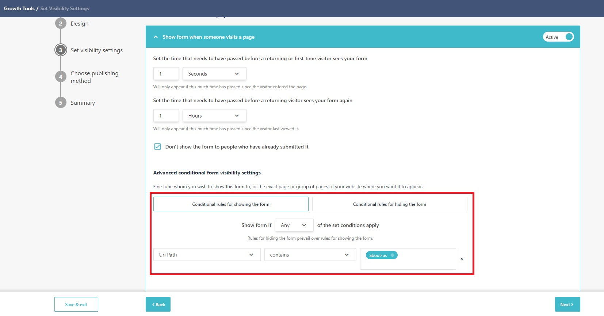
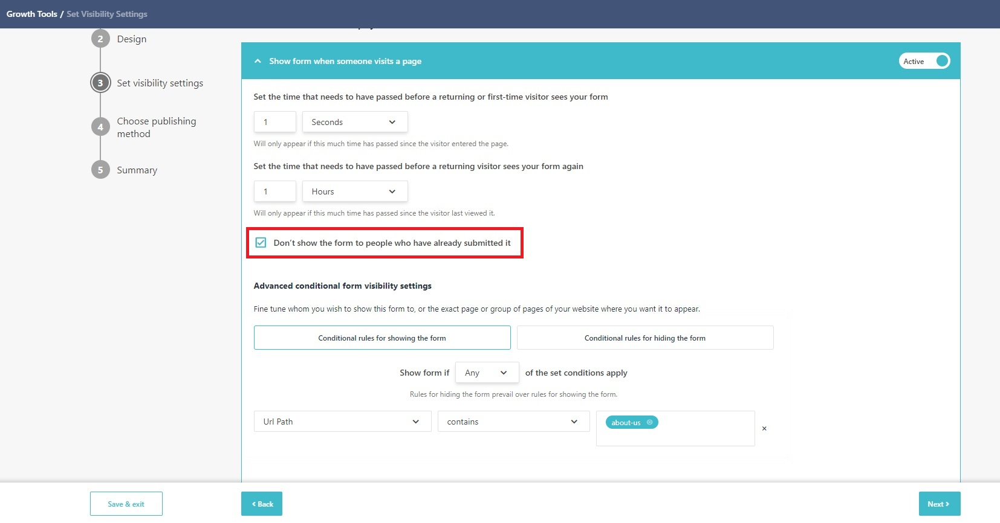
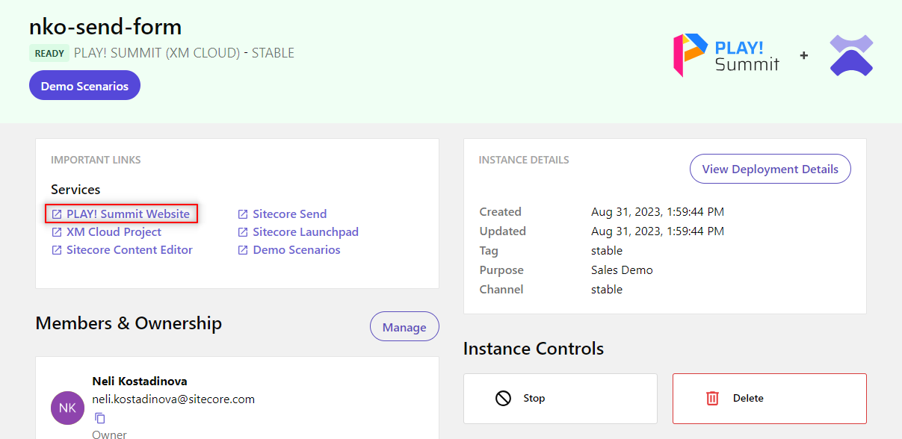
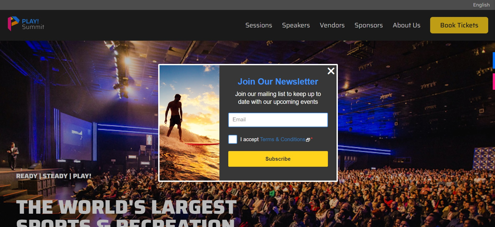
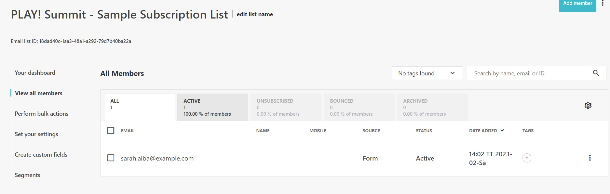

# Popup Forms

This scenario will examine a pre-configured popup form.

1. Go to  **"Growth Tools"** -> **"Subscription Forms"** <https://sitecoresendemo.sitecoresend.io/campaigns/list/Regular/1> and click on the form named **"PLAY! Summit - Sample popup form for website"**.

1. You can review the configuration steps. The **"Set Visibility Settings"** are used to define where and when a popup form appears on a connected website. This popup form is configured to appear on the website for any pages that include **"about-us"** in the URL.

1. The popup form is configured to hide for returning visitors for 1 hour after viewing the popup. For demo purposes, you can open the webpage in incognito mode to always see the popup as a new visitor or you can update the settings so return visitors always see the form. For example, you can set the time to 1 second and return visitors will always see the form popup again.

1. The popup form is also configured to hide if the current visitor has already submitted the form. You can turn off this setting for demo purposes if you would like the popup to display in the same browsing session after form submission.

1. Go to your [demo instance overview page](https://portal.sitecoredemo.com/instance/{{demoId}}) and click on the **"PLAY! Summit Website"** link to open the PLAY! Summit demo website.

1. Go to the **"About Us"** page on the PLAY! Summit website by clicking on the **"About Us"** option in the navigation. You should see the popup form appear after a short delay. If you do not see the popup form appear, try opening the **"About Us"** page in incognito mode in your browser.

1. Complete and submit the popup form.

1. After form submission, the contact will be added to the email list named **"PLAY! Summit - Sample Subscription List"**. Navigate to the email lists (<https://sitecoresendemo.sitecoresend.io/mailing-lists-new/list/mailing-lists/1>) and select **"PLAY! Summit - Sample Subscription List"**. Click on the **"View all members"** option in the left-hand menu to view the contact you added.

