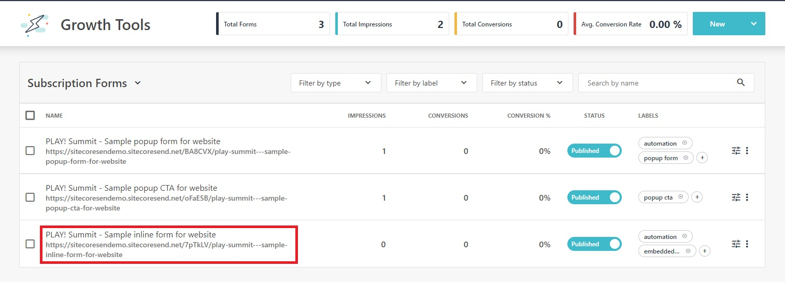
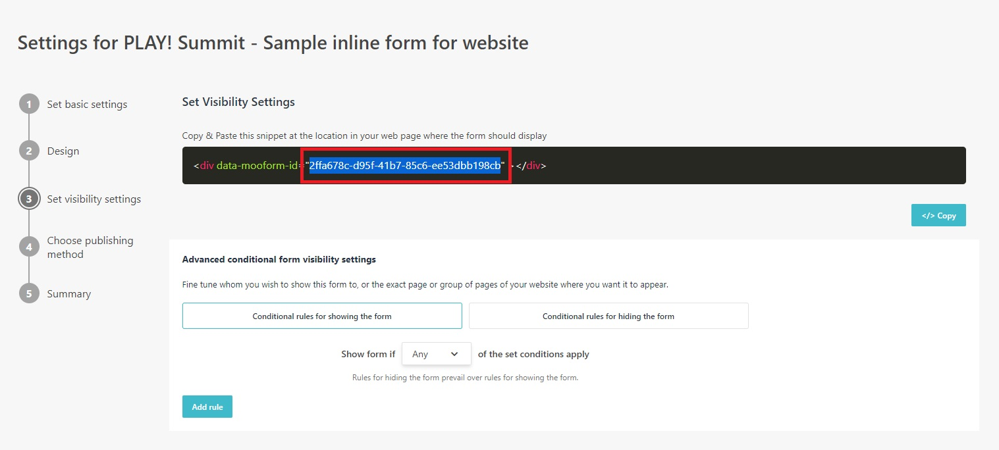
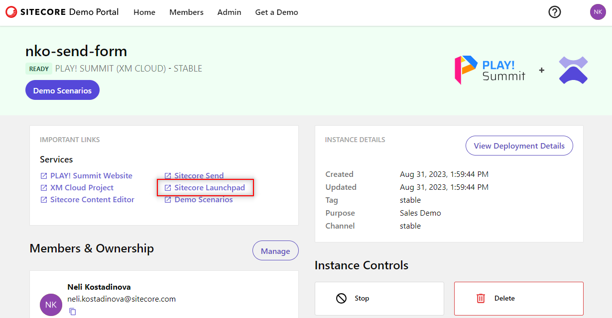
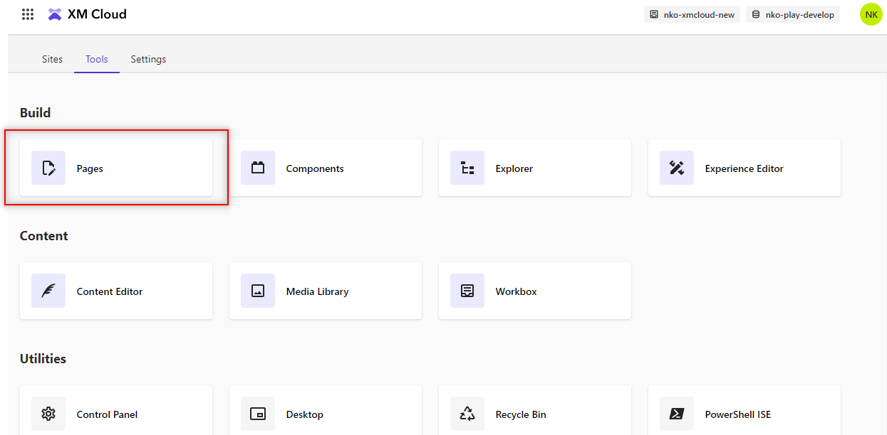
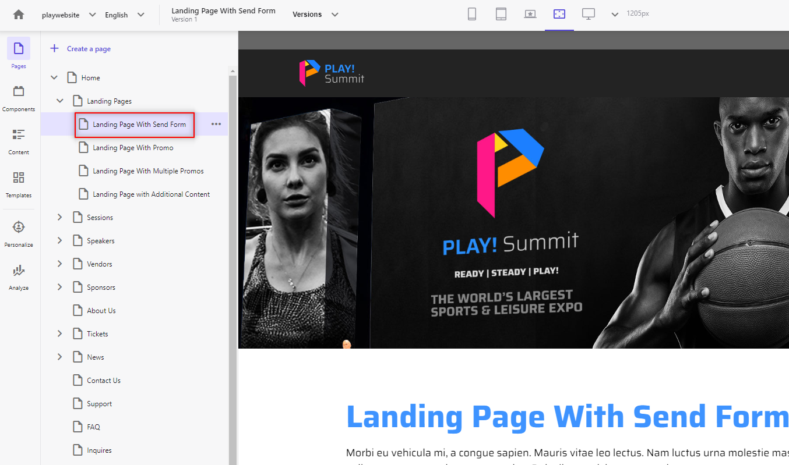
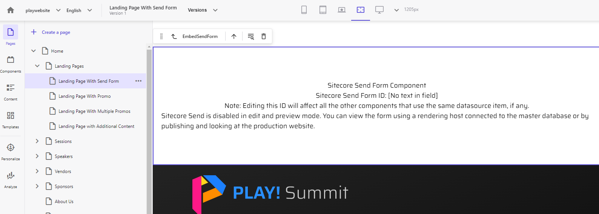
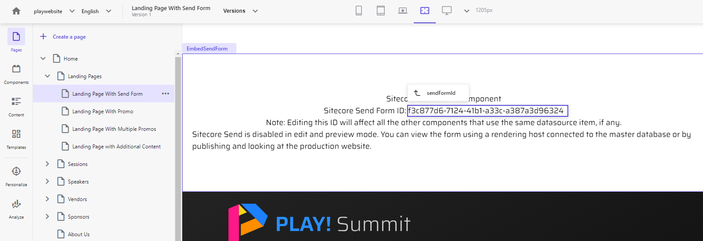
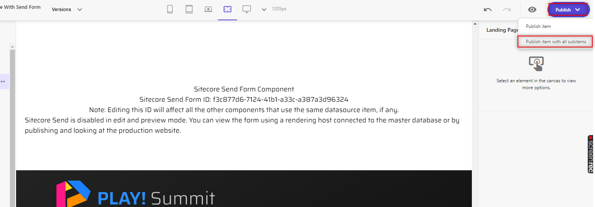
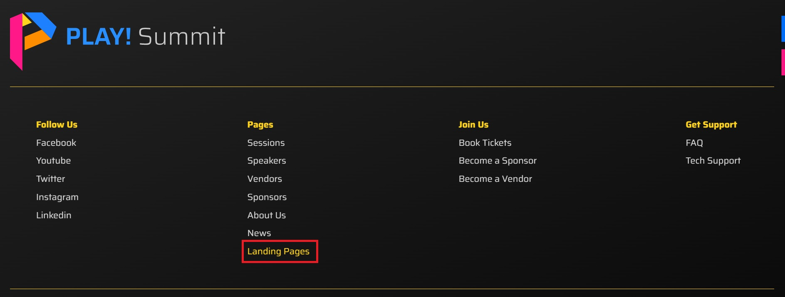

# Embedded Forms

## Adding an Embedded Form to a Landing Page

This scenario will demonstrate how to add a Sitecore Send embedded form to a landing page on the PLAY! Summit demo website.

1. Go to  **"Growth Tools"** -> **"Subscription Forms"** <https://sitecoresendemo.sitecoresend.io/campaigns/list/Regular/1> and click on the form named **"PLAY! Summit - Sample inline form for website"**.

1. Go to the **"Set Visibility Settings"** (step 3) in the left-hand menu and copy the embedded form ID. You can also find the form ID in the browser URL. Save the form ID for **"Step 7"**.

1. Go to your [demo instance overview page](https://portal.sitecoredemo.com/instance/{{demoId}}). Click on the **"Sitecore Launchpad"** link.

1. Click on the  **"Pages"** tile on the Sitecore Launchpad.

1. Navigate to the **"Landing Page with Send Form"** webpage using the sidebar.

1. Scroll down the landing page and find the component that contains the **"Sitecore Send Form Component"** heading text and **"Sitecore Send Form ID"** label text.

1. Click on the **"No text in field"** field and fill it with the embedded form ID you copied and saved in **"Step 2"**.

1. Click on the **"Publish"** button to publish your changes to the website.

1. Go to your [demo instance overview page](https://portal.sitecoredemo.com/instance/{{demoId}}) and click on the **"PLAY! Summit Website"** link to open the PLAY! Summit demo website.

1. Scroll down to the bottom of the PLAY! Summit demo website. Click on the **"Landing Pages"** link in the footer navigation.

1. The available landing pages will be listed. Click on the **"Landing Page with Send Form"** landing page.

1. The landing page will be displayed with the embedded form Sitecore Send. If you do not see the form displayed right away, perform a **"hard refresh"** of the page in the browser to ensure the page is not cached.

Just like the scenario listed above, the same approach can be used to add an embedded form anywhere within the PLAY! Summit demo website. Add the embedded form component named **"EmbedSendForm"** to any PLAY! Summit webpage.
