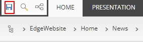

# Content and Page Creation

This scenario shows how to create new and manage existing content pages.

1. Go to the [Sitecore Launchpad](https://{{demoName}}-cm.sitecoredemo.com/sitecore/login).

1. Click Experience Editor.

1. Open the "Home" tab.

1. Expand the "Home" node in the breadcrumb and click the "News" section.

1. Click the "Go" button in the breadcrumb.

1. Open the "Home" tab again.

1. Click the "Insert page" button.

1. You will see the "Insert Item" pop-up window. Fill in the "Name" field and click the "OK" button.

1. Fill in the "Excerpt" and "Content" fields, clicking [NO TEXT IN FIELD].

1. Click the image and you will see the "Image" field. Click the "Choose DAM image" button.

1. You will see the "Insert from Sitecore DAM" pop-up window.

1. Scroll down the slider and click the image, you want.

1. You will see the "File to insert" pop-up window. Click the "Select" button.

1. You will see the updated changes in your news article.

1. Click the "Save changes" button.

1. Click the "OK" button in the "Message" pop-up window.

1. Click the "Submit" button.

1. Click the "OK" button in the "Enter a comment" pop-up window.

1. Click the "Approve" button.

1. Click the "OK" button in the "Enter a comment" pop-up window.

1. Open the "Home" tab and click the "Publish" button.

1. You will see the "Publish Item" pop-up window. Click the "Publish" button.

1. Click the "OK" button in the "Message" pop-up window.

1. Click the "Close" button in the "Publish Item" pop-up window.

1. Go to the [PLAY! Summit Website](https://{{demoName}}-{{demoUid}}-website.vercel.app).

1. Scroll down the page and click the "View All News" button.

1. You will see the created news article there.
