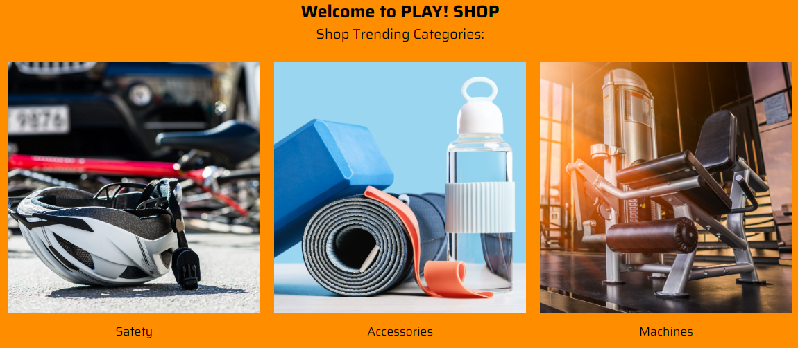

> This scenario shows Sitecore Discover functionality in the demo.

1. Go to "Play! Shop" website.

2. You will see different Shop Trending Categories there and
    recommended products for you by default.

> 

3. Click the search bar and you will see top results based on trending
    categories located in the left pane.

> 

4. Enter the name of the item you are interested in to the search bar
    and you will see available search options.

> 
>
> Note, that there are related query suggestions in the left pane under
> "Did you mean?" section.

5. You can explore all products related to your search by clicking the
    "View all" link in the right corner of the page.

> 

6. Scroll down and choose "Bike light set" product.

> 

7. Click the "Add To Cart" button.

> 

8. Return to the homepage and you will see updated recommended products
    for you based on your intention to purchase a similar product.

> 
>
> This demonstrates that after you expressed your interest in bikes, you
> see bike-related accessories in the recommended products section based
> on it.

9. Click the shopping cart icon in the right top corner of your page
    and you will see an unfinished purchase there.

10. Click the "View full cart" button.

11.  You will see your chosen item there, recommended products for you,
    prompting you to add another purchase to your cart and recently
    viewed products.

> 
