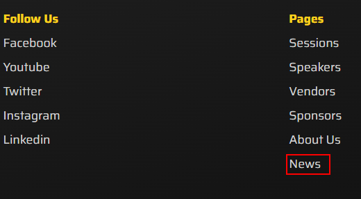

# Workflow creation scenario

<!-- TODO: This scenario shows that Sitecore CMS allows different types of users to work on content and collaborate with each other during the content creation process. -->

## Part 1. Minnie (content author) creates a news article and submits it for approval.

1. Go to your instance details page at <https://portal.sitecoredemo.com/instance/{{demoId}}>.

1. You will see available types of users and their usernames. In this scenario we are going to log in as user Minnie.

1. Go to <https://{{demoName}}-cm.sitecoredemo.com/sitecore/login>.

1. Enter "Minnie" into the "User Name" field and copy password into the "Password" field.

1. Click the "Log in" button.

1. You will see the Sitecore launchpad with limited access for a content author role.

1. Go to "Experience Editor".

1. Click the expand arrow near the "Home" title in a breadcrumb path.

1. Choose the "News" section.

1. Click the "Go" button.

1. You will see a list of news pages that exist.

1. Toggle the ribbon in the right top corner of the webpage.

1. Click on "Insert page" icon.

1. Create a new page.

1. Click "OK" button.

1. You will see a title, introduction text, body text and image, which can be updated.

1. Save all your changes by clicking Save icon in the top left corner of the panel.

1. When the changes were saved by our content author (Minnie), you can submit this news page for content approver (Pete) by clicking the action button "Submit".

1. You will see a pop-up window, where you need to fill in comments for approver and click "OK" button.

1. The page will be reloaded, and you will see a bunch of warnings in the left top corner, which shows that the updated content was sent to approver.

1. Now you can log out from the website.

## Part 2. Pete (content approver) approves updated content and publishes it to the website.

1. Log in as a user Pete.

1. Click on the "Workbox" tile.

1. Click the "Demo Workflow" checkbox to see the workflow items.

1. You will see items, which are awaiting approval.

1. Click "Approve" button next to the "News Page Test". You can also preview the changes by clicking "Preview".

1. You will see a comments pop-up window.

1. Click "OK" button.

1. Return to the "PLAY! Summit" website and click on News section in the footer of the page.

1. You will see your "News Page Test" article among other news.

